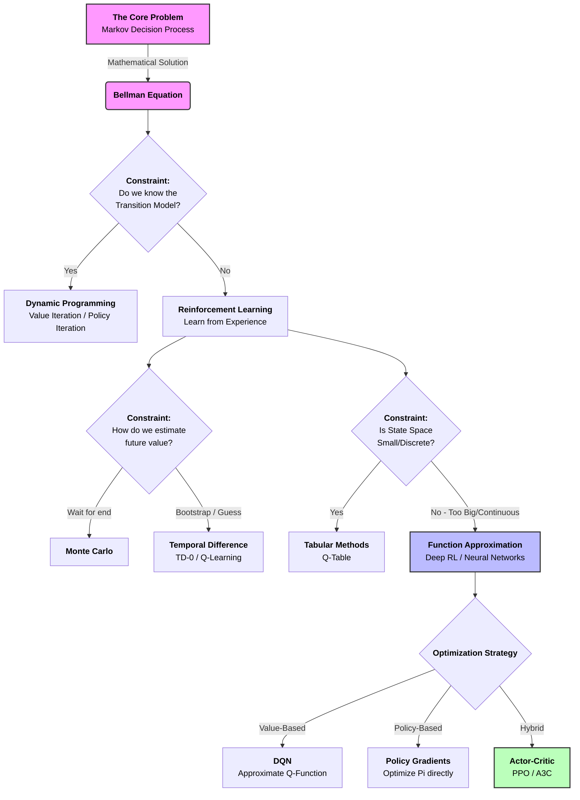

# The Big Picture of Reinforcement Learning

Based on the [Reddit discussion](https://www.reddit.com/r/reinforcementlearning/comments/1prttxz/let_me_know_whether_my_bigpicture_understanding/), this document maps the landscape of Reinforcement Learning (RL) by starting with the theoretical ideal and introducing algorithms as solutions to specific practical constraints ("relaxations").

## 1. The Theoretical Foundation (The "Ideal")
At its core, RL models problems as **Markov Decision Processes (MDPs)**.
*   **Goal:** Find an optimal policy $\pi^*$ that maximizes expected return.
*   **The Math:** This is solved using the **Bellman Optimality Equation**.
*   **The Constraint:** To solve this *exactly*, you need:
    1.  A known model of the environment (transition probabilities $P(s'|s,a)$ and reward function $R(s,a)$).
    2.  A manageable (small/discrete) state and action space.

## 2. Relaxing Assumptions (The "Real World")

Modern RL algorithms exist because real-world problems violate the "Ideal" constraints. We move from exact solutions to approximations by relaxing specific assumptions.

### Relaxation A: "We don't know the Model" (Estimation)
**Problem:** We don't know $P(s'|s,a)$. We can't calculate exact expectations.
**Solution:** We must **sample** the environment.
*   **Monte Carlo:** Wait for an episode to finish, then average the actual returns. (Unbiased, high variance).
*   **Temporal Difference (TD):** Update estimates based on other estimates ($V(s_{t+1})$) without waiting for the end. This is **Bootstrapping**.
    *   *Examples:* TD(0), SARSA, Q-Learning.

### Relaxation B: "The State Space is too Big" (Approximation)
**Problem:** The world is continuous or has too many states to store in a table (e.g., pixels in an image).
**Solution:** Use **Function Approximation**. Instead of a table $Q(s,a)$, we learn a function $f(s,a; \theta)$ (e.g., a Neural Network) that estimates the value.
*   **Deep Q-Learning (DQN):** Combines Q-Learning (TD) with Neural Networks (Approximation).

### Relaxation C: "We want to plan" (Model-Based)
**Problem:** Model-free methods require massive amounts of experience.
**Solution:** **Indirect RL / Model-Based RL**.
1.  Learn the model of the world (approximate $P$ and $R$).
2.  Plan inside that mental model (e.g., using Dynamic Programming or Tree Search).
    *   *Examples:* Dyna-Q, MuZero.

### Alternative Path: Policy Optimization
**Problem:** Value-based methods (learning $Q$ or $V$) can be indirect and struggle with continuous action spaces.
**Solution:** Optimize the **Policy** directly ($\pi(a|s)$).
*   **Policy Gradients:** Adjust policy parameters $\theta$ to increase the probability of high-reward actions.
*   **Actor-Critic:** Learn a Policy ("Actor") *and* a Value function ("Critic") to reduce variance.
    *   *Examples:* PPO, A3C.

---

## 3. Visual Map

