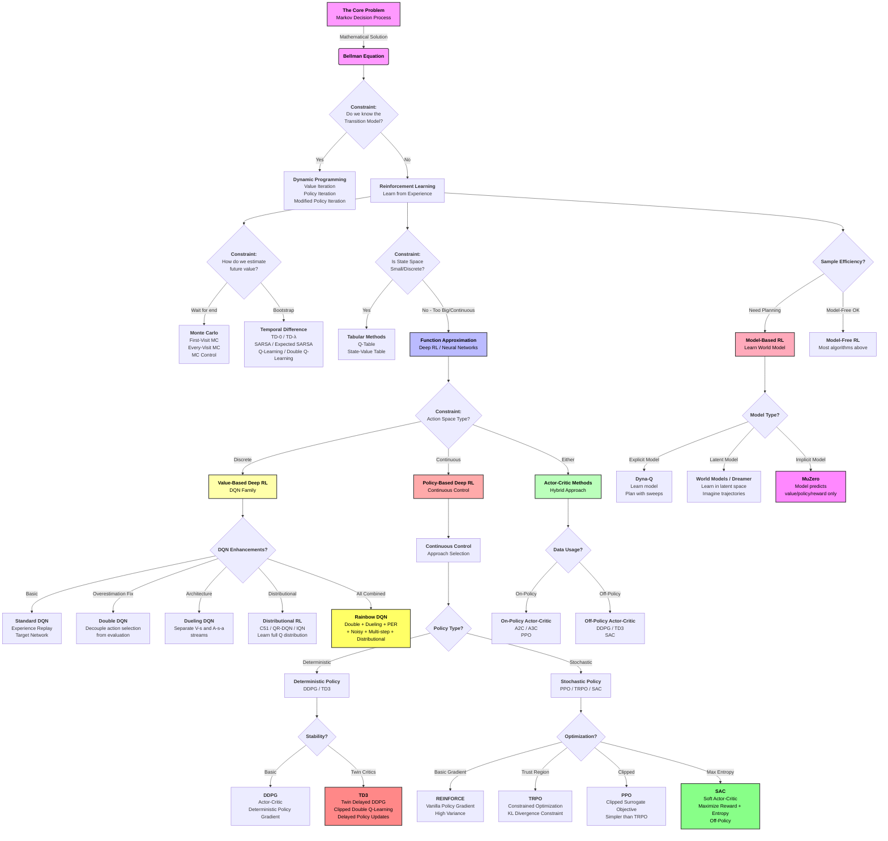

# The Big Picture of Reinforcement Learning (Enhanced Proposal)

Based on the [Reddit discussion](https://www.reddit.com/r/reinforcementlearning/comments/1prttxz/let_me_know_whether_my_bigpicture_understanding/), this document maps the landscape of Reinforcement Learning (RL) by starting with the theoretical ideal and introducing algorithms as solutions to specific practical constraints ("relaxations").

## 1. The Theoretical Foundation (The "Ideal")
At its core, RL models problems as **Markov Decision Processes (MDPs)**.
*   **Goal:** Find an optimal policy $\pi^*$ that maximizes expected return.
*   **The Math:** This is solved using the **Bellman Optimality Equation**.
*   **The Constraint:** To solve this *exactly*, you need:
    1.  A known model of the environment (transition probabilities $P(s'|s,a)$ and reward function $R(s,a)$).
    2.  A manageable (small/discrete) state and action space.
    3.  Full observability of the state.

## 2. Relaxing Assumptions (The "Real World")

Modern RL algorithms exist because real-world problems violate the "Ideal" constraints. We move from exact solutions to approximations by relaxing specific assumptions.

### Relaxation A: "We don't know the Model" (Estimation)
**Problem:** We don't know $P(s'|s,a)$. We can't calculate exact expectations.
**Solution:** We must **sample** the environment.
*   **Monte Carlo:** Wait for an episode to finish, then average the actual returns. (Unbiased, high variance).
    *   *Examples:* First-Visit MC, Every-Visit MC, MC Control
*   **Temporal Difference (TD):** Update estimates based on other estimates ($V(s_{t+1})$) without waiting for the end. This is **Bootstrapping**.
    *   *Examples:* TD(0), TD(λ), SARSA, Q-Learning, Expected SARSA, Double Q-Learning

### Relaxation B: "The State Space is too Big" (Approximation)
**Problem:** The world is continuous or has too many states to store in a table (e.g., pixels in an image).
**Solution:** Use **Function Approximation**. Instead of a table $Q(s,a)$, we learn a function $f(s,a; \theta)$ (e.g., a Neural Network) that estimates the value.
*   **Deep Q-Learning (DQN):** Combines Q-Learning (TD) with Neural Networks (Approximation).
    *   *Variants:* Double DQN, Dueling DQN, Prioritized Experience Replay, Rainbow DQN, Noisy DQN

### Relaxation C: "We want to plan" (Model-Based)
**Problem:** Model-free methods require massive amounts of experience.
**Solution:** **Indirect RL / Model-Based RL**.
1.  Learn the model of the world (approximate $P$ and $R$).
2.  Plan inside that mental model (e.g., using Dynamic Programming or Tree Search).
    *   *Examples:* Dyna-Q, World Models, MuZero, Dreamer

### Relaxation D: "Continuous Action Spaces"
**Problem:** Value-based methods struggle with continuous actions (can't maximize over infinite actions).
**Solution:** Optimize the **Policy** directly ($\pi(a|s)$) or use deterministic policies.
*   **Policy Gradients:** Adjust policy parameters $\theta$ to increase the probability of high-reward actions.
    *   *Examples:* REINFORCE, TRPO, PPO
*   **Deterministic Policy Gradients:** For continuous control with deterministic policies.
    *   *Examples:* DDPG, TD3
*   **Actor-Critic:** Learn a Policy ("Actor") *and* a Value function ("Critic") to reduce variance.
    *   *Examples:* A2C, A3C, PPO, SAC, TD3

### Relaxation E: "On-Policy vs Off-Policy"
**Problem:** Some algorithms can only learn from their current policy (on-policy), limiting sample efficiency.
**Solution:** **Off-Policy Learning** - learn from any experience, including old policies or other agents.
*   **On-Policy:** SARSA, A2C, A3C, PPO, TRPO
*   **Off-Policy:** Q-Learning, DQN, DDPG, TD3, SAC

### Relaxation F: "Partial Observability"
**Problem:** Agent cannot fully observe the state (e.g., vision with occlusions, hidden variables).
**Solution:** **Partially Observable MDPs (POMDPs)** - use history or memory.
*   *Examples:* Recurrent policies (LSTM/GRU), Attention mechanisms, Belief-state planning

---

## 3. Visual Map (Enhanced)

## 4. Key Distinctions

### By Learning Type
- **Value-Based:** Learn Q(s,a) or V(s), derive policy implicitly (e.g., DQN, Q-Learning)
- **Policy-Based:** Learn π(a|s) directly (e.g., REINFORCE, TRPO, PPO)
- **Actor-Critic:** Learn both Q/V and π (e.g., A2C, PPO, SAC, TD3)

### By Data Usage
- **On-Policy:** Must use data from current policy (e.g., A2C, PPO)
- **Off-Policy:** Can use old data, more sample-efficient (e.g., DQN, SAC, TD3)

### By Action Space
- **Discrete Actions:** Q-Learning, DQN, SARSA
- **Continuous Actions:** DDPG, TD3, SAC, PPO

### By Model Usage
- **Model-Free:** Don't learn environment dynamics (most algorithms)
- **Model-Based:** Learn world model, plan ahead (Dyna-Q, MuZero, Dreamer)

---

## 5. Algorithm Selection Guide

| Scenario | Recommended Algorithms |
|----------|------------------------|
| Discrete actions, small state space | Q-Learning, SARSA |
| Discrete actions, large state space | DQN, Rainbow, PPO |
| Continuous actions, continuous states | TD3, SAC, PPO |
| Need sample efficiency | Model-Based (MuZero, Dreamer), Off-Policy (SAC, TD3) |
| Stable training priority | PPO, SAC |
| Maximum performance | SAC (continuous), Rainbow (discrete) |
| Simple baseline | DQN (discrete), DDPG (continuous) |
| Partial observability | Recurrent policies (LSTM + any algorithm) |

