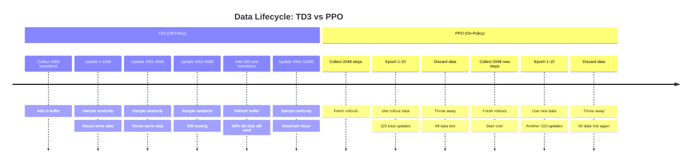
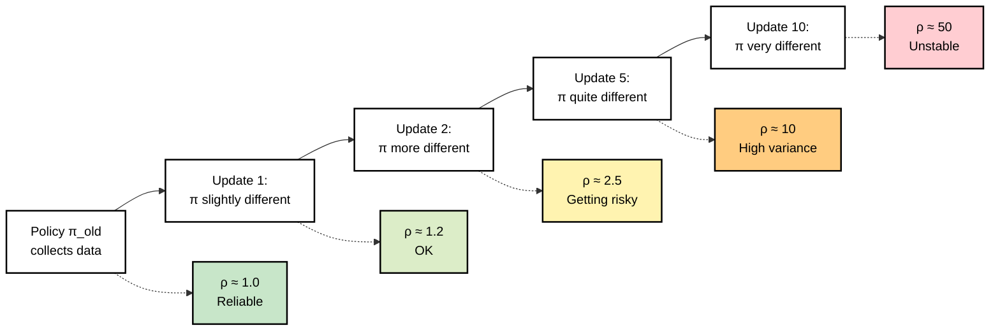
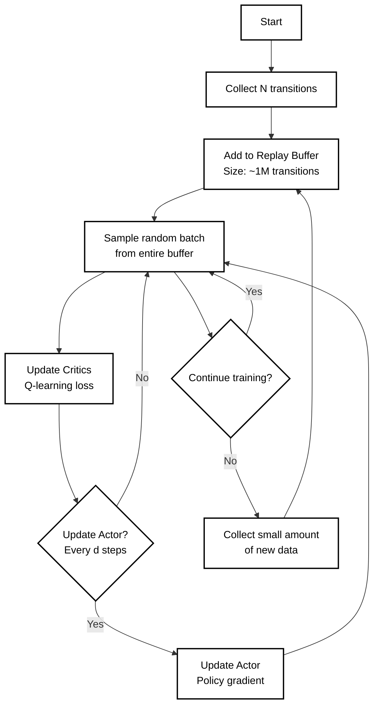
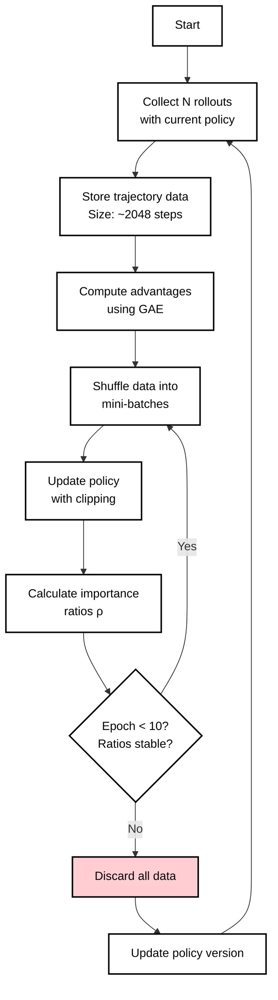
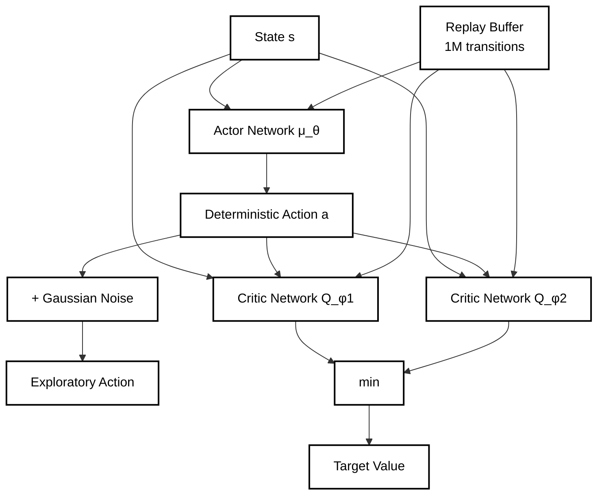
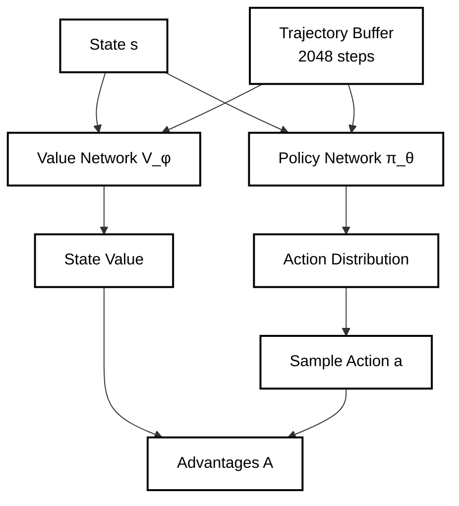

# Reinforcement Learning Algorithm Comparison: TD3, DDPG, and PPO

## Algorithm Classification

**TD3 (Twin Delayed Deep Deterministic Policy Gradient)** and **DDPG** are both **deterministic policy gradient** methods for continuous action spaces, while **PPO (Proximal Policy Optimization)** is a **stochastic policy gradient** method.

## Key Differences

### DDPG vs TD3
- **TD3 is an improved version of DDPG** that addresses its main limitations
- **Twin Critics**: TD3 uses two Q-networks and takes the minimum Q-value to reduce overestimation bias (DDPG uses one)
- **Delayed Updates**: TD3 updates the policy less frequently than the critic to reduce variance
- **Target Policy Smoothing**: TD3 adds noise to target actions during critic updates for regularization

### PPO vs DDPG/TD3
- **Action Space**: PPO handles both discrete and continuous actions; DDPG/TD3 are designed for continuous only
- **Policy Type**: PPO uses stochastic policies (samples actions from distributions); DDPG/TD3 use deterministic policies
- **Sample Efficiency**: DDPG/TD3 are generally more sample efficient; PPO is more stable but requires more samples
- **On/Off-Policy**: PPO is on-policy (uses current policy data); DDPG/TD3 are off-policy (can use replay buffers)

## On-Policy vs Off-Policy Deep Dive

### Off-Policy Algorithms (TD3, DQN, Q-Learning)
**Core Principle**: Can learn from data generated by any policy, including older versions or random exploration.

**Data Usage**:
- Use **experience replay**: store transitions (s,a,r,s') in a buffer
- Sample random batches from the buffer for training
- Each transition can be reused thousands of times
- Data never becomes "stale" - a transition from 100k steps ago is still valid

**Sample Efficiency**: Very high
- Example: collect 1000 transitions → perform 10,000 gradient updates
- Only need occasional fresh data to keep buffer diverse

### On-Policy Algorithms (PPO, REINFORCE, SARSA)
**Core Principle**: Only learn from data generated by the current policy version.

**Data Usage**:
- Collect sequential **rollouts** (trajectories) with current policy
- Use data for a few training epochs while policy hasn't changed much
- Must discard data once policy updates significantly
- Need fresh rollouts for each training cycle

**Sample Efficiency**: Lower
- Example: collect 2048 steps → use for ~10 epochs (320 updates) → discard

### Sample Efficiency Comparison

### The Importance Sampling Problem
PPO attempts to reuse data across multiple epochs using importance sampling:

$$\rho = \frac{\pi_{new}(a|s)}{\pi_{old}(a|s)}$$

The policy gradient is reweighted by this importance ratio:
$$\mathcal{L}^{PG} = \rho \cdot A(s,a)$$

**Why This Becomes Problematic**:
1. **Extreme ratios create high variance**:
   - If $\rho = 90$, one sample dominates the entire batch gradient
   - If $\rho = 0.01$, sample becomes nearly irrelevant
   - Training becomes unstable and noisy

2. **Policy drift accumulates**:
   - Each update changes the policy slightly
   - After many updates, new policy is very different from data collection policy
   - Importance ratios become unreliable

3. **PPO's clipping workaround**:
   $$\mathcal{L}^{CLIP} = \min\left(\rho \cdot A, \text{clip}(\rho, 1-\epsilon, 1+\epsilon) \cdot A\right)$$
   - Prevents catastrophic updates but limits learning
   - Can only extend data reuse to ~10 epochs before becoming ineffective

### Why TD3 Avoids This Problem
TD3's Q-learning update doesn't use importance sampling at all:

$$y = r + \gamma \min(Q_{\phi_1}(s', \mu_{\theta}(s')), Q_{\phi_2}(s', \mu_{\theta}(s')))$$
$$\mathcal{L}(\phi) = (Q_{\phi}(s,a) - y)^2$$

**Key advantages**:
- No policy probabilities in the update → no importance ratios
- Only needs to know: "what happened" (s,a,r,s') and "what's optimal from s'"
- Works regardless of what policy generated the original data
- Can reuse data indefinitely until buffer overwrites it

## Training Flow Comparison

### TD3 Training Flow

**Key characteristics**:
- Buffer grows to large size (e.g., 1M transitions)
- Each transition used in hundreds of gradient updates
- Training can continue with very little new data collection

### PPO Training Flow

**Key characteristics**:
- Must collect fresh data every training cycle
- Each transition used in only ~10 gradient updates
- Training stops without continuous data collection

## Algorithm Architecture Comparison

### TD3 Architecture

### PPO Architecture

## Exploration Strategies

### TD3 Exploration
- Adds **Gaussian noise** to deterministic policy during data collection
- Noise is external to policy (exploration vs exploitation decoupled)
- Can adjust noise independently without changing policy architecture

### PPO Exploration  
- **Built-in stochasticity** - policy naturally outputs action distributions
- Exploration emerges from sampling from these distributions
- Exploration decreases as policy becomes more confident (lower entropy)

## Advantages Analysis

### Advantages in PPO
Traditional advantages: $A(s,a) = Q(s,a) - V(s)$

**Generalized Advantage Estimation (GAE)**:
$$\delta_t = r_t + \gamma V(s_{t+1}) - V(s_t)$$
$$A_t = \sum_{l=0}^{\infty} (\gamma\lambda)^l \delta_{t+l}$$

**Purpose**: 
- Reduce variance in policy gradients
- Tell policy "this action was better/worse than average"
- Enable stable learning from trajectory data

### No Advantages in TD3
TD3 doesn't use advantages because:
- Q-learning directly estimates action values $Q(s,a)$
- Actor gradient uses Q-values directly: $\nabla_\theta Q(s, \mu_\theta(s))$
- No need to subtract baselines - the deterministic policy gradient handles this

## Technical Comparison

| Aspect | DDPG | TD3 | PPO |
|--------|------|-----|-----|
| **Policy Type** | Deterministic | Deterministic | Stochastic |
| **Action Space** | Continuous | Continuous | Both |
| **Critic Networks** | 1 Q-network | 2 Q-networks (twin) | 1 Value network |
| **Update Strategy** | Simultaneous actor-critic | Delayed policy updates | Clipped policy updates |
| **Exploration** | Noise injection | Target policy smoothing + noise | Built-in stochasticity |
| **Stability** | Prone to overestimation | More stable than DDPG | Very stable |
| **Sample Efficiency** | High | High | Lower |

## When to Use Each

- **TD3**: Best for continuous control tasks where sample efficiency matters and you need deterministic policies
- **DDPG**: Use TD3 instead (TD3 is strictly better)
- **PPO**: Best for discrete actions, when stability is crucial, or when you have abundant computational resources

## Trading Strategy Applications

- **TD3**: Ideal for continuous trading actions (position sizing, order quantities)
- **PPO**: Good for discrete trading decisions (buy/sell/hold) or when training stability is paramount
- **DDPG**: Generally replaced by TD3 for better performance