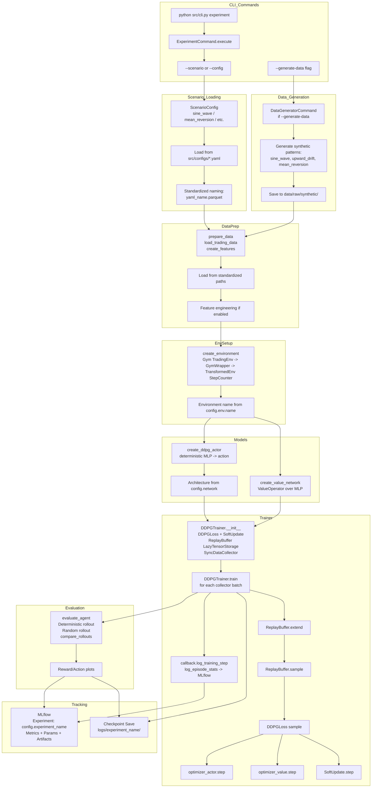
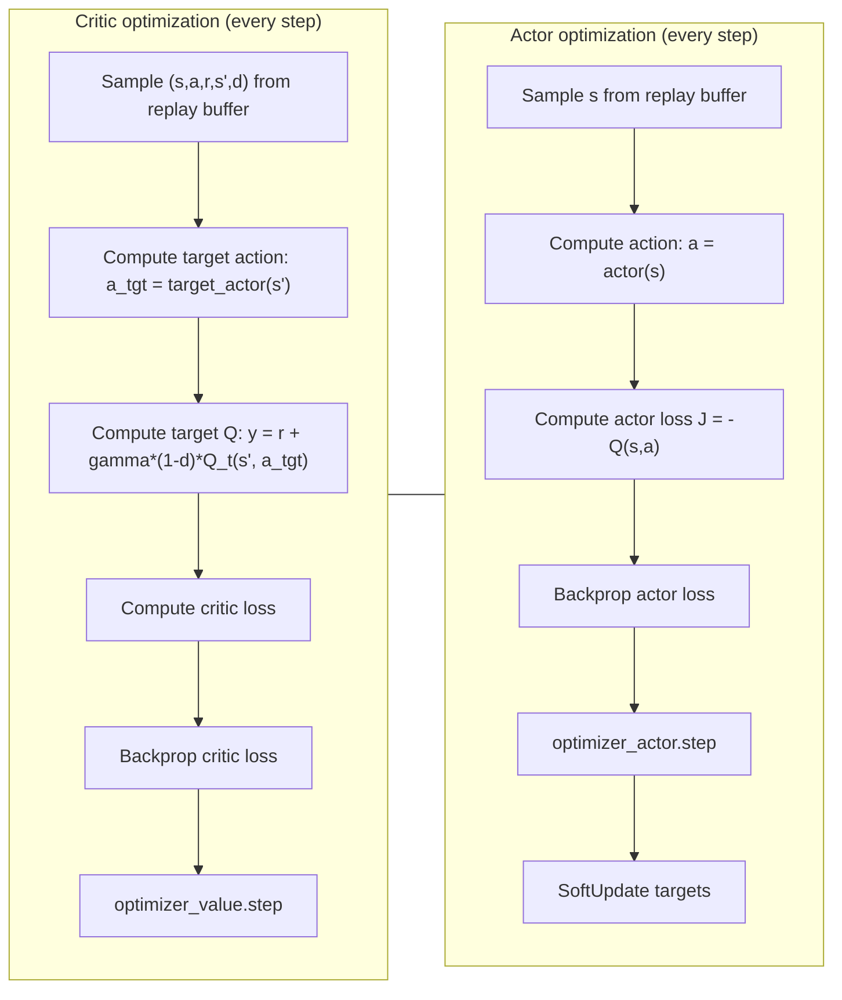

# DDPG Implementation Overview

## Summary
- Off-policy deterministic actor-critic for continuous actions.
- Uses replay buffer, target networks, and soft updates.
- Training logs and evaluations flow through MLflow.

## Core Ideas
- **Deterministic Policy**: Actor outputs continuous actions directly.
- **Target Networks**: Stabilize critic targets via lagged copies.
- **Replay Buffer**: Off-policy updates from stored transitions.

## Flow

## Optimization Detail

## Math Summary

Let the actor be $\mu_\theta(s)$ and the critic be $Q_\phi(s,a)$. Target networks are $\mu_{\bar\theta}, Q_{\bar\phi}$.

**Notation**
- $s, a, r, s', d$: state, action, reward, next state, and done flag.
- $\mathcal{B}$: replay buffer distribution.
- $\gamma$: discount factor.
- $\tau$: soft-update rate.
- $\theta$: actor parameters; $\bar\theta$: target actor parameters.
- $\phi$: critic parameters; $\bar\phi$: target critic parameters.
- $a_{tgt}$: target action from target actor.

**Critic target**
$$
y = r + \gamma (1-d)\, Q_{\bar\phi}(s', \mu_{\bar\theta}(s'))
$$

**Critic loss**
$$
L(\phi) = \mathbb{E}_{(s,a,r,s',d)\sim\mathcal{B}} \left( Q_\phi(s,a) - y \right)^2
$$

**Actor loss**
$$
J(\theta) = - \mathbb{E}_{s\sim\mathcal{B}} \left[ Q_\phi(s, \mu_\theta(s)) \right]
$$

**Soft target updates**
$$
\bar\phi \leftarrow \tau \phi + (1-\tau)\bar\phi,\quad
\bar\theta \leftarrow \tau \theta + (1-\tau)\bar\theta
$$

## Components
- **CLI + configs**: scenario/config selection and optional data generation.
- **Environment**: Gym trading env wrapped for TorchRL and `StepCounter`.
- **Models**: deterministic actor (`create_ddpg_actor`) + critic (`create_value_network`).
- **Trainer**: `DDPGTrainer` with `DDPGLoss`, replay buffer, and `SoftUpdate`.

## Training Loop
- Collect batch → extend replay buffer → sample minibatches.
- Critic and actor updates each step.
- Soft-update target networks with `tau`.
