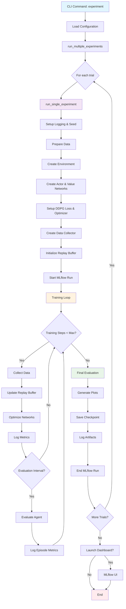
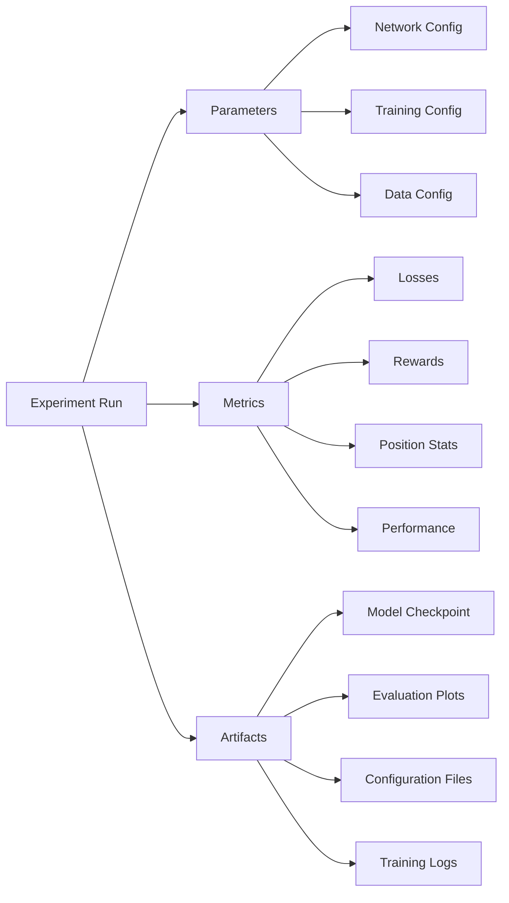

# Trading RL Experiment Workflow

This document describes the complete workflow for running trading reinforcement learning experiments in this project.

## Overview

The experiment system is designed to train DDPG (Deep Deterministic Policy Gradient) agents on trading environments with comprehensive MLflow tracking, evaluation, and visualization.

## Workflow Diagram



## Component Details

### 1. Configuration Loading
- Loads YAML configuration file or uses defaults
- Validates configuration parameters
- Sets up experiment-specific parameters

### 2. Data Preparation
- **Function**: `prepare_data()`
- **Location**: `src/trading_rl/data_utils.py`
- **Steps**:
  - Load raw data from parquet files
  - Create technical features (if not using `--no-features`)
  - Apply normalization and preprocessing
  - Split into train/validation sets

### 3. Environment Creation
- **Function**: `create_environment()`
- **Location**: `src/trading_rl/train_trading_agent.py`
- **Steps**:
  - Initialize TorchRL trading environment
  - Apply transforms (StepCounter, etc.)
  - Set reward function and trading parameters

### 4. Network Architecture
- **Actor Network**: Policy network for action selection
- **Value Network**: Critic network for value estimation
- **Configurable**: Hidden dimensions, activation functions
- **Location**: `src/trading_rl/models.py`

### 5. Training Loop
The main training loop performs these steps cyclically:

#### Data Collection
- Use current policy to interact with environment
- Collect experience tuples (state, action, reward, next_state)
- Handle exploration vs exploitation

#### Network Updates
- Sample batches from replay buffer
- Compute DDPG losses (actor and critic)
- Update networks using gradient descent
- Apply soft target updates

#### Evaluation & Logging
- **Metrics Logged**:
  - Actor and critic losses
  - Episode rewards and lengths
  - Position change ratios
  - Portfolio performance
  - Network gradients and weights

### 6. MLflow Integration



## Key Components

### ExperimentConfig
Configuration dataclass containing all experiment parameters:
- **DataConfig**: Data paths, symbols, preprocessing options
- **NetworkConfig**: Architecture specifications
- **TrainingConfig**: Learning rates, batch sizes, etc.
- **LoggingConfig**: Output directories and verbosity

### Data Flow
1. **Raw Data** → `load_trading_data()`
2. **Feature Engineering** → `create_features()`
3. **Environment** → TorchRL trading environment
4. **Agent Training** → DDPG algorithm
5. **Evaluation** → Performance metrics and plots

### Evaluation Process
- **Function**: `evaluate_agent()`
- **Generates**:
  - Reward comparison plots (agent vs benchmarks)
  - Action sequence visualizations
  - Performance metrics
- **Benchmarks**:
  - Buy-and-hold strategy
  - Maximum theoretical profit

## Usage Examples

### Basic Experiment
```bash
python src/cli.py experiment --config ./src/configs/default.yaml --trials 3
```

### Custom Configuration
```bash
python src/cli.py experiment \
  --config ./src/configs/upward_drift_optimized.yaml \
  --trials 5 \
  --name "upward_drift_test" \
  --dashboard
```

### Configuration Options
- `--no-features`: Skip feature engineering, use raw OHLCV data
- `--dashboard`: Launch MLflow UI after completion
- `--clear-cache`: Clear data processing cache
- `--seed`: Set random seed for reproducibility

## Output Structure

```
logs/
├── experiment_name/
│   ├── training.log
│   ├── model_checkpoint.pt
│   └── evaluation_plots/
└── mlruns/
    └── experiment_id/
        ├── run_id_1/
        ├── run_id_2/
        └── ...
```

## Error Handling

The system includes comprehensive error handling for:
- **Data Loading**: Missing files, corrupt data
- **Network Training**: Gradient explosions, convergence issues
- **Environment**: Invalid actions, state inconsistencies
- **MLflow**: Logging failures, artifact corruption

## Performance Optimization

- **Joblib Caching**: Expensive data operations are cached
- **Parallel Data Collection**: Vectorized environment interactions
- **Memory Management**: Efficient replay buffer implementation
- **GPU Support**: Automatic CUDA detection and usage

## Monitoring & Debugging

### Key Metrics to Watch
- **Actor Loss**: Should generally decrease over time
- **Critic Loss**: Should stabilize after initial training
- **Episode Reward**: Should show improvement trend
- **Position Change Ratio**: Indicates trading frequency vs exploration

### Common Issues
- **High Position Changes**: Often indicates scale/normalization issues
- **Flat Learning**: May need different learning rates or architecture
- **Evaluation Errors**: Usually related to data preprocessing mismatches