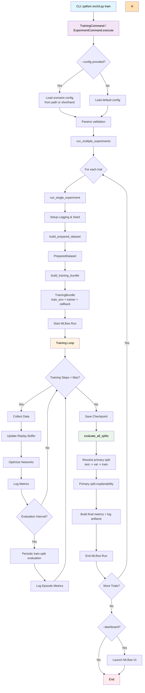
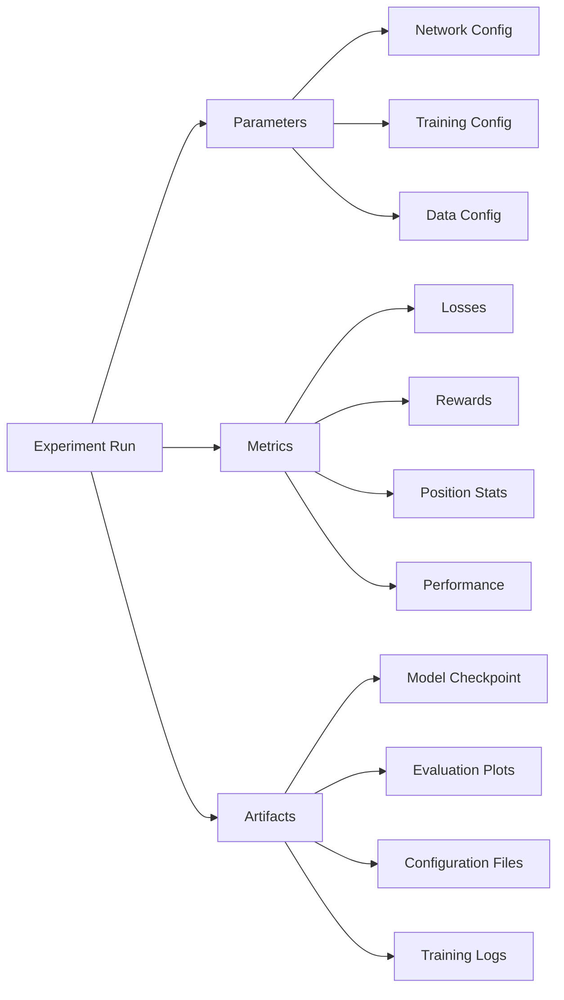

# Trading RL Experiment Workflow

This document describes the complete workflow for running trading reinforcement learning experiments in this project.

## Overview

The experiment system can train PPO, DDPG, or TD3 agents on trading environments with comprehensive MLflow tracking, evaluation, and visualization. Choose the algorithm via `training.algorithm` in the config (PPO, DDPG, or TD3).

## Workflow Diagram


``` mermaid
flowchart TD
    A[CLI: python src/cli.py train] --> B[TrainingCommand / ExperimentCommand.execute]
    B --> C{--config provided?}
    C -->|Yes| D[Load scenario config<br/>from path or shorthand]
    C -->|No| E[Load default config]
    D --> F[Params validation]
    E --> F
    F --> I[run_multiple_experiments]
    
    I --> J{For each trial}
    J --> K[run_single_experiment]
    K --> L[Setup Logging & Seed]
    L --> M[build_prepared_dataset]
    M --> N[PreparedDataset]
    N --> O[build_training_bundle]
    O --> P[TrainingBundle<br/>train_env + trainer + callback]
    P --> Q[Start MLflow Run]
    
    Q --> W[Training Loop]
    W --> X{Training Steps < Max?}
    X -->|Yes| Y[Collect Data]
    Y --> Z[Update Replay Buffer]
    Z --> AA[Optimize Networks]
    AA --> BB[Log Metrics]
    BB --> CC{Evaluation Interval?}
    CC -->|Yes| DD[Periodic train-split evaluation]
    DD --> EE[Log Episode Metrics]
    EE --> X
    CC -->|No| X
    
    X -->|No| FF[Save Checkpoint]
    FF --> GG[evaluate_all_splits]
    GG --> HH[Resolve primary split<br/>test -> val -> train]
    HH --> II[Primary split explainability]
    II --> JJ[Build final metrics + log artifacts]
    JJ --> KK[End MLflow Run]
    
    KK --> LL{More Trials?}
    LL -->|Yes| J
    LL -->|No| MM{--dashboard?}
    MM -->|Yes| NN[Launch MLflow UI]
    MM -->|No| OO[End]
    NN --> OO
    
    style A fill:#e1f5fe,color:black
    style B fill:#f3e5f5,color:black
    style W fill:#fff3e0,color:black
    style GG fill:#e8f5e8,color:black
    style OO fill:#ffebee,color:black
    style H fill:#ffe0b2,color:black
```

## Component Details

### 1. Configuration Loading

Each scenario lives in a directory under `src/configs/scenarios/<group>/<name>/` with up to four component files merged in order:

| File | Purpose |
| --- | --- |
| `observation.yaml` | Feature pipeline path and active `env.feature_columns` |
| `train.yaml` | Data path, env, network, training hyperparameters |
| `evaluate.yaml` | Benchmark and statistical-test overrides (evaluate command only) |
| `feature_selection.yaml` | IC-selected column subset; applied when `data.automated_selection: true` |

`ExperimentConfig.from_scenario(dir, command)` performs the merge via OmegaConf. CLI `--config-override` dotlist values are applied on top. Legacy single-file YAML paths are still accepted.

### 2. Data Preparation

-   **Functions**: `prepare_data()` and `build_prepared_dataset()`
-   **Location**: `src/trading_rl/data_utils.py`
-   **Steps**:
    -   Load raw data from parquet files
    -   Split chronologically before fitting features
    -   Fit the feature pipeline on train only and transform all splits
    -   Apply HFT-specific close/index repairs when required
    -   Return a `PreparedDataset` bundle with split frames and metadata

### 3. Environment Creation

-   **Builder**: `AlgorithmicEnvironmentBuilder` with backend-aware factories
-   **Location**: `src/trading_rl/envs/`
-   **Steps**:
    -   Backend is chosen from `config.env.backend` (fallback: algorithm default)
    -   Supported backends:
        -   `gym_trading_env.discrete` (default, positions e.g. `[-1, 0, 1]`)
        -   `gym_trading_env.continuous` (TD3/DDPG; continuous → discrete wrapper)
        -   `gym_anytrading.forex` (requires positions `[0, 1]` short/long)
        -   `gym_anytrading.stocks` (requires positions `[0, 1]` short/long)
    -   Applies transforms (StepCounter, optional Continuous→Discrete action map)
    -   Trading params and reward function come from config

### 4. Network Architecture

-   **Actor Network**: Policy network for action selection
-   **Value Network**: Critic network for value estimation (twin critics for TD3)
-   **Configurable**: Hidden dimensions, activation functions
-   **Construction**: `build_training_bundle()` creates the train env, selects the trainer class, builds models, and wires the callback

### 5. Training Loop

The main training loop performs these steps cyclically:

#### Data Collection

-   Use current policy to interact with environment
-   Collect experience tuples (state, action, reward, next_state)
-   Handle exploration vs exploitation

#### Network Updates

-   Sample batches from replay buffer
-   Compute losses (PPO, DDPG, or TD3)
-   Update networks using gradient descent
-   Apply soft target updates (DDPG/TD3)

#### Evaluation & Logging

-   **Metrics Logged**:
    -   Actor and critic losses
    -   Episode rewards and lengths
    -   Position change ratios
    -   Portfolio performance
    -   Network gradients and weights

### 6. MLflow Integration


``` mermaid
graph LR
    A[Experiment Run] --> B[Parameters]
    A --> C[Metrics]
    A --> D[Artifacts]
    
    B --> B1[Network Config]
    B --> B2[Training Config]
    B --> B3[Data Config]
    
    C --> C1[Losses]
    C --> C2[Rewards]
    C --> C3[Position Stats]
    C --> C4[Performance]
    
    D --> D1[Model Checkpoint]
    D --> D2[Evaluation Plots]
    D --> D3[Configuration Files]
    D --> D4[Training Logs]
```

## Key Components

### ExperimentConfig

Configuration dataclass containing all experiment parameters: - **DataConfig**: Data paths, symbols, preprocessing options - **NetworkConfig**: Architecture specifications - **TrainingConfig**: Learning rates, batch sizes, etc. - **LoggingConfig**: Output directories and verbosity

### Data Flow

1.  **Raw Data** → `load_trading_data()`
2.  **Prepared Dataset** → `build_prepared_dataset()`
3.  **Training Bundle** → `build_training_bundle()`
4.  **Agent Training** → PPO / DDPG / TD3 trainers
5.  **Evaluation** → `evaluate_all_splits()` plus final metrics and plots

### Evaluation Process

-   **Function**: `evaluate_agent()`
-   **Generates**:
    -   Reward comparison plots (agent vs benchmarks)
    -   Action sequence visualizations
    -   PPO-only action probability distribution plot
    -   Combined evaluation plot artifact (reward | actions) / probs when available
-   **Benchmarks**:
    -   Buy-and-hold strategy
    -   Maximum theoretical profit

## Usage Examples

### Basic Single Run

``` bash
uv run python src/cli.py train --scenario sine_wave/ppo_no_trend
```

`--scenario` accepts a `group/name` shorthand (resolved under `src/configs/scenarios`) or a full directory path. `--config` still works for a legacy single-file YAML.

### Multiple Trials

``` bash
uv run python src/cli.py train --scenario sine_wave/ppo_no_trend --trials 3 --name "sweep_run"
```

### PPO/DDPG/TD3 Selection

- Set `training.algorithm` in your config to `PPO`, `DDPG`, or `TD3`.
- TD3 requires continuous-action setups (or a discretized wrapper) and twin Q-value networks; defaults are built when you pick TD3.

### Custom Configuration

``` bash
uv run python src/cli.py train \
  --config sine_wave/ppo_no_trend \
  --trials 5 \
  --name "upward_drift_test" \
  --config-override training.max_steps=50000
```

### CLI Options — `train`

-   `--trials N`: Run N independent trials (default 1); checkpoint resume is only available for single runs
-   `--clear-cache`: Clear data processing cache before running
-   `--config-override/-o`: Apply OmegaConf dotlist overrides (repeatable)
-   `--from-checkpoint <path>`: Resume from a specific checkpoint file
-   `--from-last-checkpoint`: Resume from the most recent checkpoint for the experiment
-   `--additional-steps N`: Extra steps to train when resuming a checkpoint
-   `--mlflow-run-id <id>`: Append metrics into an existing MLflow run
-   `--verbose/-v` / `--log-regex`: Control console log verbosity

## Standalone Evaluation

Training automatically calls `evaluate_all_splits()` at the end of each run. For post-hoc evaluation (e.g. using a different split, re-running just plots, or running benchmarks on an existing checkpoint without retraining) use the dedicated `evaluate` command:

``` bash
uv run python src/cli.py evaluate \
  -c pooled/td3_hft_lob_state_space_pooled_streaming_selected_dsr \
  --output-dir logs/my_eval \
  --split test \
  --only metrics \
  --only benchmarks \
  --only plots
```

### CLI Options — `evaluate`

| Option | Description |
|---|---|
| `-c / --scenario <scenario>` | Scenario identifier (e.g. `pooled/td3_hft_lob_state_space_pooled_streaming_selected_dsr`) |
| `--output-dir <path>` | Directory for results and plots (default: `./eval_results`) |
| `--split all\|train\|val\|test` | Which data split to evaluate (default: `all`) |
| `--only <component>` | Restrict to specific components: `metrics`, `benchmarks`, `plots`, `stats`. Repeatable. |
| `--no-mlflow` | Skip MLflow logging |
| `--checkpoint <path>` | Explicit checkpoint path; auto-discovered when omitted |
| `--verbose / -v` | Enable DEBUG logging |

After evaluation, `--output-dir` contains:

- `results.json` — per-split metrics for all symbols
- `benchmark_tables/test_benchmark_table.json` and `.png`
- `evaluation_data/test_observations_head_5000.parquet`
- `<split>_<symbol>_reward_plot.png` — one plot per split/symbol combination

### Experiment Batch Scripts

Three shell scripts in `scripts/` automate the full train → evaluate → report → thesis-export pipeline for each hypothesis:

| Script | Coverage |
|---|---|
| `scripts/run_h1_experiments.sh` | TD3 / DDPG / PPO / Random, all with DSR reward |
| `scripts/run_h2_experiments.sh` | Minimal / selected / full feature variants |
| `scripts/run_h3_experiments.sh` | All sensitivity axes (feature / reward / cost) |

All three scripts accept the same flags:

``` bash
--skip-train      # evaluate only (checkpoints must already exist)
--skip-eval       # train only, skip evaluate + report + export
--parallel        # run all variants concurrently (background jobs)
--verbose / -v    # enable DEBUG logging
```

Ad-hoc hyperparameter overrides can be injected via the environment variable `EXTRA_TRAIN_ARGS`:

``` bash
EXTRA_TRAIN_ARGS="training.max_steps=5000 training.checkpoint_interval=4000" \
  bash scripts/run_h1_experiments.sh
```

### Thesis Export

After evaluation, export results as Quarto thesis snapshots with:

``` bash
# Single scenario
uv run python scripts/export_eval_to_thesis.py \
  --scenario pooled/td3_hft_lob_state_space_pooled_streaming_selected_dsr

# All scenarios for one or more hypotheses
uv run python scripts/export_all_to_thesis.py                     # all hypotheses
uv run python scripts/export_all_to_thesis.py --hypothesis h1     # H1 only
uv run python scripts/export_all_to_thesis.py --hypothesis h1 h2  # H1 and H2
```

Snapshots land in `thesis/qmd/results/{experiment_name}/latest_finished/` and contain `evaluation_report.json`, `statistical_tests.json`, `run.json`, and a `plots/` subdirectory.

## Experiments Command

The `experiments` command lists, soft-deletes, and permanently purges MLflow experiments stored in the local SQLite DB.

``` bash
# List all experiments
uv run python src/cli.py experiments

# Soft-delete experiments whose name contains the given substring
uv run python src/cli.py experiments --delete "selected_dsr"

# Permanently remove already-soft-deleted experiments (shows confirmation prompt)
uv run python src/cli.py experiments --purge
uv run python src/cli.py experiments --purge --delete "selected_dsr"  # filtered
uv run python src/cli.py experiments --purge --dry-run               # preview only
uv run python src/cli.py experiments --purge --force                 # skip prompt
```

Use case: MLflow raises `Cannot set a deleted experiment as the active experiment`. Soft-deleting blocks name reuse for new runs; `--purge` frees the name permanently.

## Output Structure

```
logs/
├── <experiment>_train.log              # training stdout (parallel mode)
├── <experiment>_eval.log              # evaluate stdout (parallel mode)
├── <experiment>/                       # evaluate --output-dir target
│   ├── results.json                    # per-split metrics for all symbols
│   ├── benchmark_tables/
│   │   ├── test_benchmark_table.json
│   │   └── test_benchmark_table.png
│   ├── evaluation_data/
│   │   └── test_observations_head_5000.parquet
│   └── <split>_<symbol>_reward_plot.png
└── pooled_<experiment>/                # training working dir
    ├── <experiment>_checkpoint_step_<N>.pt
    └── <experiment>_checkpoint_step_<N>_buffer/  (optional replay buffer dump)
```

MLflow artifacts are stored separately under `mlruns/`:

```
mlruns/
└── <experiment_id>/
    ├── <run_id_1>/
    ├── <run_id_2>/
    └── ...
```

### Dashboard

The MLflow UI is launched with:

``` bash
uv run python src/cli.py dashboard --port 5001
```

Note: on macOS, port 5000 is claimed by AirPlay / ControlCenter. Always use port 5001 (or any other free port) to avoid a bind error.

## Error Handling

The system includes comprehensive error handling for: - **Data Loading**: Missing files, corrupt data - **Network Training**: Gradient explosions, convergence issues - **Environment**: Invalid actions, state inconsistencies - **MLflow**: Logging failures, artifact corruption

## Performance Optimization

-   **Joblib Caching**: Expensive data operations are cached
-   **Parallel Data Collection**: Vectorized environment interactions
-   **Memory Management**: Efficient replay buffer implementation
-   **GPU Support**: Automatic CUDA detection and usage

## See Also

- [Data Download and Generation Guide](./data_guide.md) - How to obtain training data
- [Thesis Artifact Bridge](./thesis_artifact_bridge.md) - How evaluate output flows into Quarto chapters
- [PPO Implementation Overview](./ppo_implementation_overview.md) - PPO algorithm details
- [DDPG Implementation Overview](./ddpg_implementation_overview.md) - DDPG algorithm details
- [TD3 Implementation Overview](./td3_implementation_overview.md) - TD3 algorithm details
- [Trading RL Package](../src/trading_rl/README.md) - Core RL package overview

## Monitoring & Debugging

### Key Metrics to Watch

-   **Actor Loss**: Should generally decrease over time
-   **Critic Loss**: Should stabilize after initial training
-   **Episode Reward**: Should show improvement trend
-   **Position Change Ratio**: Indicates trading frequency vs exploration

### Common Issues

-   **High Position Changes**: Often indicates scale/normalization issues
-   **Flat Learning**: May need different learning rates or architecture
-   **Evaluation Errors**: Usually related to data preprocessing mismatches
-   **Overfitting**: Agent performs well on training data but fails on validation, often due to lack of regularization or too many parameters
-   **Reward Instability**: Large fluctuations in reward per episode, suggesting the reward function might be too sparse or noisy
-   **NaN Gradients**: Exploding gradients caused by unscaled inputs or too high learning rates; check data normalization
