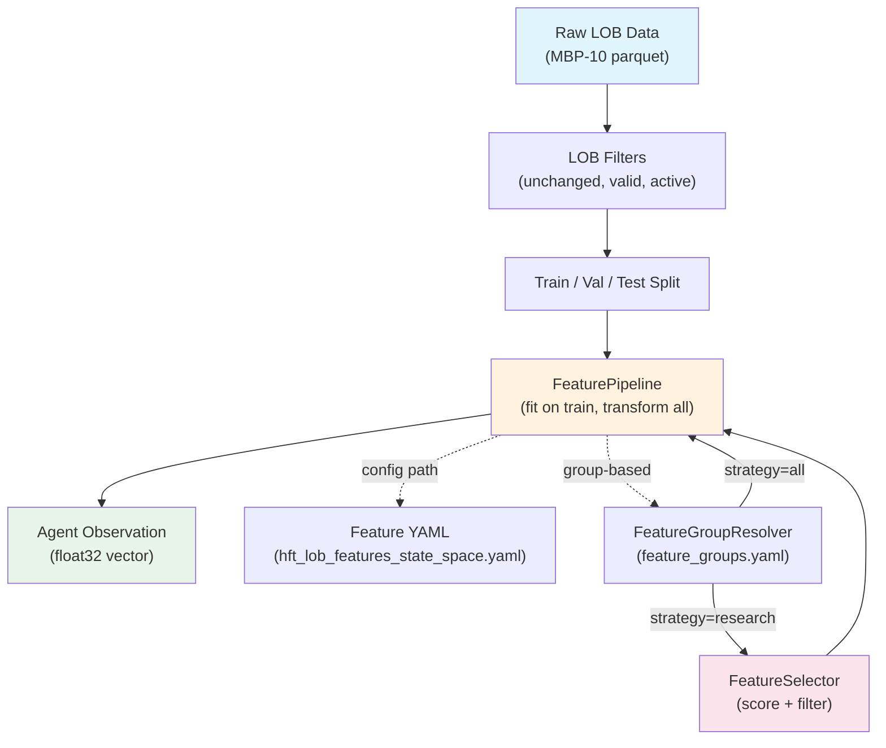
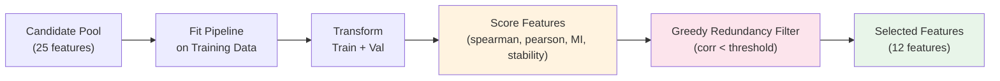
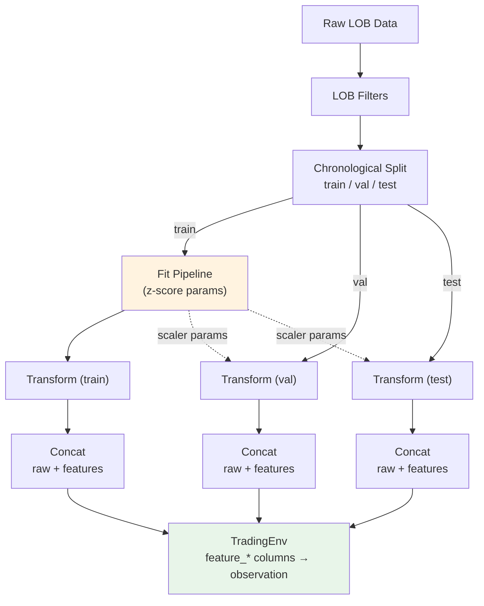

# Feature Pipeline Architecture

## Overview

The feature pipeline transforms raw LOB (Limit Order Book) data into engineered observation vectors for the RL agent. It supports two modes of feature set construction:

1. **Direct YAML config** — manually specify features in a YAML file (legacy)
2. **Group-based composition** — compose features from named groups, optionally with research-based selection



## Feature Group Composition

Features are organized into semantic groups matching the HFT state-space design:

| Group | Description | Features |
|-------|-------------|----------|
| `imbalance` | Order book imbalance signals | book_pressure (L0-L2), order_book_imbalance (3L), order_count_imbalance |
| `fair_value` | Fair value and microprice estimates | microprice, microprice_divergence, vwmp_skew |
| `spread` | Spread and cost features | spread_bps, spread_ratio, book_convexity (bid/ask), bid_ask_slope (bid/ask) |
| `flow` | Order flow and trade flow features | ofi, ofi_rolling, queue_depletion (bid/ask), signed_trade_flow, odd_lot_trade_ratio, odd_lot_imbalance |
| `regime` | Regime and temporal features | inter_event_time, mid_price_acceleration, hour_sin, hour_cos |

Groups are composed via `FeatureGroupResolver`:

```python
from trading_rl.features import FeatureGroupResolver, FeaturePipeline

resolver = FeatureGroupResolver.from_yaml("src/configs/features/feature_groups.yaml")

# Use specific groups
configs = resolver.resolve(["imbalance", "fair_value", "flow"])
pipeline = FeaturePipeline(configs)

# Use all groups with exclusions
configs = resolver.resolve(
    resolver.list_groups(),
    exclude=["feature_hft_book_pressure_l2"],
)
pipeline = FeaturePipeline(configs)
```

## Feature Selection (Research Strategy)

The `FeatureSelector` applies offline screening to reduce a candidate pool:



### Scoring

Each feature is scored against a forward log-return proxy target:

| Component | Weight | Description |
|-----------|--------|-------------|
| `|spearman_val|` | 0.45 | Validation set Spearman correlation |
| `|pearson_val|` | 0.35 | Validation set Pearson correlation |
| `mutual_information` | 0.20 | Non-linear dependence (sklearn) |
| `stability_gap` | -0.20 | Penalty for train/validation divergence |

### Redundancy Filter

Features are ranked by score. Each candidate is added only if its absolute correlation with all already-selected features is below `corr_threshold` (default 0.85). This prevents selecting near-duplicate signals.

### Usage

Feature selection is an **offline** step. Run it once to produce a reduced feature YAML, then point the training config at that file.

**Step 1: Run selection offline**

```python
from trading_rl.features import FeatureGroupResolver, FeatureSelector, FeatureSelectorConfig

resolver = FeatureGroupResolver.from_yaml("src/configs/features/feature_groups.yaml")
candidates = resolver.resolve(resolver.list_groups())

selector = FeatureSelector(FeatureSelectorConfig(top_k=12, corr_threshold=0.85))
result = selector.select(candidates, train_df, val_df)

# Write selected features to a YAML for training
FeatureSelector.write_selected_yaml(
    result,
    "src/configs/features/selected_aapl_hft.yaml",
)
```

**Step 2: Place the selected features in the scenario directory**

With the component-file config layout, write the selected columns into `feature_selection.yaml` inside the scenario directory:

```yaml
# src/configs/scenarios/aapl/td3_hft_lob_state_space/feature_selection.yaml
env:
  feature_columns:
    - feature_hft_book_pressure_l0
    - feature_hft_ofi
    # ... IC-selected subset
```

Then enable automatic selection in `train.yaml`:

```yaml
# src/configs/scenarios/aapl/td3_hft_lob_state_space/train.yaml
data:
  automated_selection: true   # loads feature_selection.yaml on top of features.yaml
```

When `automated_selection: false` (the default), `env.feature_columns` from `features.yaml` is used unchanged.

The `feature-research` CLI command writes `feature_selection.yaml` directly into the scenario directory when `--scenario` is provided.

### In Scenario Config

Feature groups are declared in `features.yaml` for **manual composition** (no IC selection):

```yaml
# src/configs/scenarios/aapl/td3_hft_lob_state_space/features.yaml
data:
  feature_groups: "src/configs/features/feature_groups.yaml"
  feature_config: "src/configs/features/hft_lob_features_all.yaml"
env:
  feature_columns:
    - feature_hft_book_pressure_l0
    - feature_hft_microprice
    # full manually-curated list
```

For **research-based selection**, run the offline IC scoring step (`feature-research`) to populate `feature_selection.yaml`, then set `data.automated_selection: true` in `train.yaml`.

## Data Flow



Key invariant: normalization parameters (mean, std for z-score) are estimated on the **training split only** and applied unchanged to validation and test splits. This prevents information leakage from future data into the training representation.