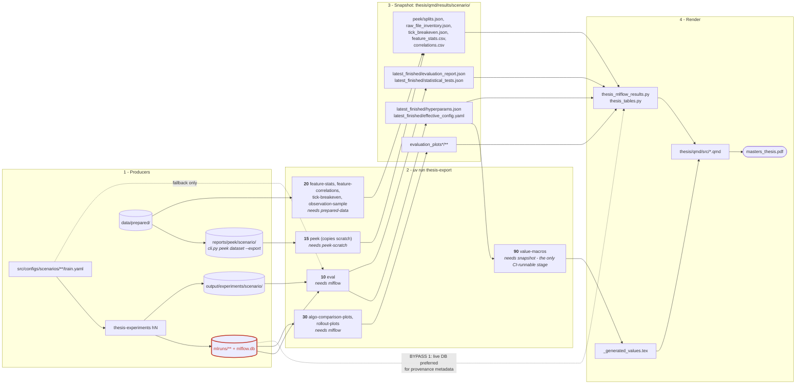

# Thesis data pipeline

Every number, table and figure the thesis renders, traced from the run that
produced it to the sentence that prints it.

The intended contract is: **the thesis reads only from `thesis/qmd/results/**`,
which is written by the export scripts.** Nothing in a `.qmd` should reach past
that boundary into MLflow, `output/experiments/`, or a scenario YAML. One path
still breaks that contract; it is marked in red below and described in
[Bypass paths](#bypass-paths).

## The pipeline



## The `peek` stage is a copy, not a computation

Worth singling out, because it behaves unlike its neighbours and the
difference is invisible from the stage list.

`cli.py peek dataset --export` summarises a prepared dataset — split sizes and
timestamp ranges, per-feature statistics, feature-return correlations, the raw
file inventory — and writes them to `reports/peek/<scenario>/`. That directory
is gitignored local scratch, so a CI checkout never has it and Chapter 5's
data-prep tables would render their "not found" fallback.

`export_peek_to_thesis.py` exists purely to promote four of those files into
the committed snapshot. It **copies**; it computes nothing. Two consequences:

**It has its own requirement.** Having `data/prepared/` is not enough — the
`peek dataset` command must actually have been run, and that command is not
part of `thesis-export`. Hence the separate `peek-scratch` requirement rather
than reusing `prepared-data`.

**Two of its four files are also written by other stages.**
`correlations.csv` and `feature_stats.csv` are computed directly from the
memmaps by `feature-correlations` and `feature-stats`. Both producers write
the same paths, so whichever runs last wins. The computed pair is the
authoritative one — the checked-in `correlations.csv` is 2,370 bytes against
the scratch copy's 740, and carries more features — so `peek` is pinned to
order 15, ahead of the order-20 group. Left at equal order the alphabetical
tie-break puts "peek" last and it would silently republish weeks-old scratch
over freshly computed data. `test_thesis_export_registry.py` guards the
ordering.

In practice `peek` therefore owns only `splits.json` and
`raw_file_inventory.json`; its other two outputs are always superseded.

**This is where the remaining staleness lives.** Every other stage recomputes
from a source of truth, so re-running it is enough. `peek` is only ever as
fresh as the last manual `peek dataset --export`; at the time of writing the
scratch was two weeks older than the snapshot built from it. Nothing reports
that. A manifest recording what each stage ran from, and when, is the fix —
`--list` currently answers "what can run here", not "what is out of date".

## What each chapter consumes

| Consumer | Reads | Via | Export-only? |
|---|---|---|---|
| `@tbl-h1-algo-comparison`, `@tbl-h1-per-symbol` (06-00) | `latest_finished/evaluation_report.json` | `load_scenario_metrics()` | yes (snapshot preferred) |
| H1 prose figures (06-00) | same | `\val*` macros | **yes** |
| Ch. 4 hyperparameters in prose | `latest_finished/hyperparams.json` | `\val*` macros | **yes** |
| `@tbl-main-experiment-spec` (99-appendix) | `latest_finished/hyperparams.json` | `load_experiment_hyperparams()` | **yes** |
| H2/H3/H4 tables (06-02) | `latest_finished/evaluation_report.json` | `load_scenario_metrics()` | yes (snapshot preferred) |
| `@tbl-dataset-splits` (05-01) | `peek/splits.json` | direct `json.loads` | **yes** |
| `@tbl-raw-file-inventory` (99-appendix) | `peek/raw_file_inventory.json` | direct `json.loads` | **yes** |
| `@tbl-tick-breakeven-fee` (99-appendix) | `peek/tick_breakeven.json` | direct `json.loads` | **yes** |
| `@tbl-feature-stats` (99-appendix) | `peek/feature_stats.csv` | `pd.read_csv` | **yes** |
| `@tbl-feature-correlations` (99-appendix) | `peek/correlations.csv` | `pd.read_csv` | **yes** |
| `@tbl-transformed-features` (99-appendix) | `observation_samples/**` | `find_observation_sample()` | **yes** |
| Figures 3–5 (06-03) | `evaluation_plots_comparison/**`, else `evaluation_plots/**` | `find_exported_plot_data()` | **yes** |
| Provenance notes under tables | live `mlflow.db`, else `run.json` | `show_table_meta(finished)` | **no — bypass 1** |

## Bypass paths

Three places read outside the snapshot. None currently changes a **reported
number**, but each makes a render depend on machine-local state, so the same
sources can produce different output on a laptop and in CI.

### 1. `load_experiment_snapshot()` prefers live MLflow

```python
# thesis_mlflow_results.py
# Prefer live MLflow so renders always reflect the latest finished run.
# Fall back to the static export when the database is unavailable (CI, offline).
```

Used in 06-00, 06-02, 06-03 and 99-appendix, but almost exclusively for
`show_table_meta(finished, ...)` — the provenance line under a table — and, in
06-03, to obtain `artifact_uri` for the figures. The table *values* come from
`load_scenario_metrics()`/`load_experiment_hyperparams()`, which are
snapshot-first. So the blast radius today is provenance display and figures,
not reported numbers.

The risk is still real: "the latest finished run" need not be the run the rest
of the chapter reports, and CI (no `mlflow.db`) silently takes a different
branch than a local render.

`runs_overview_table()` has the same preference. In 06-02 its result (`runs_df`)
is **assigned and never used** — dead code that can simply be deleted.

### 2. Figures resolved through the MLflow artifact store first — REMOVED

06-03 used to call `find_evaluation_plot_data(finished.get("artifact_uri"))`,
then `find_plot_run_in_experiment()`, before falling back to
`find_exported_plot_data()`. Both were already dead in practice: the first
returns nothing for this experiment, and the comparison export overrode
whatever the second found. They are gone; the chapter now reads figures from
the snapshot only, so a laptop and CI draw the same plots.

Note that the two plot exporters — `export_algo_comparison_plots.py` and
`export_rollout_plots_to_thesis.py` — *do* read MLflow. That is why they are a
local authoring step that commits downsampled copies, rather than part of the
pre-render chain: they cannot run where `mlruns/` is absent, which is exactly
the CI case. The `peek/*` exporters are manual for the same practical reason.

### 3. `load_scenario_metrics()` raw-results fallback — REMOVED

Historical. Preference order used to be snapshot → MLflow artifact store →
`output/experiments/<name>/results.json` read directly. The third tier was
added in the commit that first wired up the results tables, when snapshots
were not yet reliably exported, and was still present long after they were.

It was the worst of the three because it failed *silently*: `_log_fallback()`
only fires on an exception, and a missing snapshot is a falsy `exists()`, not
an exception — so a number sourced from raw run output, with no manifest, run
id or provenance, would render exactly like an exported one.

Removed, along with the two helpers it was the only caller of. All 20 scenario
snapshots exist, so nothing changed in the rendered output; a missing snapshot
now yields `{}` and the table reports the gap instead of inventing a number.
The MLflow tier (2) is retained.

## Provenance of the hyperparameters

Until #818, `hyperparams.json` was built by reading the scenario `train.yaml`
directly, so a launch-time `--config-override` was invisible: the agent could
train at `gamma=0.95` while the thesis rendered `0.9`. The exporter now prefers
the run's own `config/effective_config_*.yaml` — the resolved, post-override
config MLflow already logs — and records `source` and `source_run_id` in
`hyperparams.json`, plus `run_id` in `run.json` (previously always `null`).

One ambiguity is unresolved and deliberately surfaced as a warning: several runs
usually exist per scenario and can disagree (four full-budget H1 runs split
between `actor_weight_decay` 0.0 and 2e-06). Trained steps, read from the
checkpoint ladder, is the strongest discriminator available; ties break on
recency. See issue #816.

## Refreshing the snapshot

The pre-render hook in `thesis/qmd/src/_quarto.yml` runs on every build:

```yaml
project:
  pre-render:
    - uv run python ../../../scripts/export_all_to_thesis.py
    - uv run python ../../../scripts/generate_thesis_value_macros.py
```

The `peek/*` artifacts are **not** in that hook and are refreshed on demand:

```bash
uv run python scripts/export_peek_to_thesis.py --scenario pooled/<scenario>
uv run python scripts/export_tick_breakeven_to_thesis.py
uv run python scripts/export_streaming_feature_stats_to_thesis.py
uv run python scripts/export_streaming_feature_correlations_to_thesis.py
```
