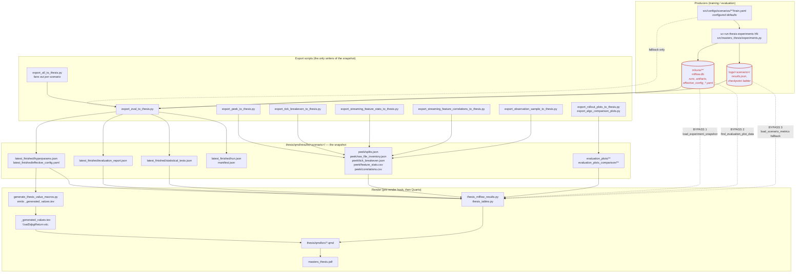

# Thesis data pipeline

Every number, table and figure the thesis renders, traced from the run that
produced it to the sentence that prints it.

The intended contract is: **the thesis reads only from `thesis/qmd/results/**`,
which is written by the export scripts.** Nothing in a `.qmd` should reach past
that boundary into MLflow, `logs/`, or a scenario YAML. Three paths currently
break that contract; they are marked in red below and listed in
[Bypass paths](#bypass-paths).

## The pipeline



## What each chapter consumes

| Consumer | Reads | Via | Export-only? |
|---|---|---|---|
| `@tbl-h1-algo-comparison`, `@tbl-h1-per-symbol` (06-00) | `latest_finished/evaluation_report.json` | `load_scenario_metrics()` | yes (snapshot preferred) |
| H1 prose figures (06-00) | same | `\val*` macros | **yes** |
| Ch. 4 hyperparameters in prose | `latest_finished/hyperparams.json` | `\val*` macros | **yes** |
| `@tbl-main-experiment-spec` (99-appendix) | `latest_finished/hyperparams.json` | `load_experiment_hyperparams()` | **yes** |
| H2/H3/H4 tables (06-02) | `latest_finished/evaluation_report.json` | `load_scenario_metrics()` | yes (snapshot preferred) |
| `@tbl-dataset-splits` (05-01) | `peek/splits.json` | direct `json.loads` | **yes** |
| `@tbl-raw-file-inventory` (99-appendix) | `peek/raw_file_inventory.json` | direct `json.loads` | **yes** |
| `@tbl-tick-breakeven-fee` (99-appendix) | `peek/tick_breakeven.json` | direct `json.loads` | **yes** |
| `@tbl-feature-stats` (99-appendix) | `peek/feature_stats.csv` | `pd.read_csv` | **yes** |
| `@tbl-feature-correlations` (99-appendix) | `peek/correlations.csv` | `pd.read_csv` | **yes** |
| `@tbl-transformed-features` (99-appendix) | `observation_samples/**` | `find_observation_sample()` | **yes** |
| Figures 3–5 (06-03) | MLflow artifact dir, else `evaluation_plots/**` | `find_evaluation_plot_data()` | **no — bypass 2** |
| Provenance notes under tables | live `mlflow.db`, else `run.json` | `show_table_meta(finished)` | **no — bypass 1** |

## Bypass paths

Three places read outside the snapshot. None currently changes a **reported
number**, but each makes a render depend on machine-local state, so the same
sources can produce different output on a laptop and in CI.

### 1. `load_experiment_snapshot()` prefers live MLflow

```python
# thesis_mlflow_results.py
# Prefer live MLflow so renders always reflect the latest finished run.
# Fall back to the static export when the database is unavailable (CI, offline).
```

Used in 06-00, 06-02, 06-03 and 99-appendix, but almost exclusively for
`show_table_meta(finished, ...)` — the provenance line under a table — and, in
06-03, to obtain `artifact_uri` for the figures. The table *values* come from
`load_scenario_metrics()`/`load_experiment_hyperparams()`, which are
snapshot-first. So the blast radius today is provenance display and figures,
not reported numbers.

The risk is still real: "the latest finished run" need not be the run the rest
of the chapter reports, and CI (no `mlflow.db`) silently takes a different
branch than a local render.

`runs_overview_table()` has the same preference. In 06-02 its result (`runs_df`)
is **assigned and never used** — dead code that can simply be deleted.

### 2. Figures resolve through the MLflow artifact store first

06-03 calls `find_evaluation_plot_data(finished.get("artifact_uri"))`, then
`find_plot_run_in_experiment()`, and only then falls back to
`find_exported_plot_data()`. A machine without `mlruns/` renders the exported
plots; a machine with it may render a different run's.

### 3. `load_scenario_metrics()` has two non-snapshot fallbacks

Preference order is snapshot → MLflow artifact store → `logs/<name>/results.json`
read directly. The first is what normally fires, but the third would silently
publish a number that was never exported.

## Provenance of the hyperparameters

Until #818, `hyperparams.json` was built by reading the scenario `train.yaml`
directly, so a launch-time `--config-override` was invisible: the agent could
train at `gamma=0.95` while the thesis rendered `0.9`. The exporter now prefers
the run's own `config/effective_config_*.yaml` — the resolved, post-override
config MLflow already logs — and records `source` and `source_run_id` in
`hyperparams.json`, plus `run_id` in `run.json` (previously always `null`).

One ambiguity is unresolved and deliberately surfaced as a warning: several runs
usually exist per scenario and can disagree (four full-budget H1 runs split
between `actor_weight_decay` 0.0 and 2e-06). Trained steps, read from the
checkpoint ladder, is the strongest discriminator available; ties break on
recency. See issue #816.

## Refreshing the snapshot

The pre-render hook in `thesis/qmd/src/_quarto.yml` runs on every build:

```yaml
project:
  pre-render:
    - uv run python ../../../scripts/export_all_to_thesis.py
    - uv run python ../../../scripts/generate_thesis_value_macros.py
```

The `peek/*` artifacts are **not** in that hook and are refreshed on demand:

```bash
uv run python scripts/export_peek_to_thesis.py --scenario pooled/<scenario>
uv run python scripts/export_tick_breakeven_to_thesis.py
uv run python scripts/export_streaming_feature_stats_to_thesis.py
uv run python scripts/export_streaming_feature_correlations_to_thesis.py
```
