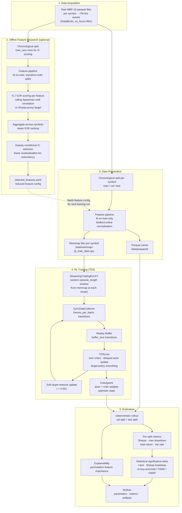

# End-to-End Workflow Overview

This diagram covers the full pipeline from raw tick data through feature research, RL training, and final evaluation.

## Stage summary

| Stage | CLI command | Key config |
|---|---|---|
| Feature research | `cli.py feature-research --scenario <name>` | `data.train_size`, `research.horizons`, `research.top_k` |
| Data preparation | runs automatically inside `train` | `data.prepared_data_dir`, `data.memmap_dir` |
| Training | `cli.py train --scenario <name>` | `training.max_steps`, `training.algorithm` |
| Evaluation | runs automatically at end of `train` | `statistical_testing.enabled` |

## Key numbers (pooled HFT scenario)

| Parameter | Value | Meaning |
|---|---|---|
| Raw rows per symbol | ~7M | ~4 trading days of MBP-10 tick data |
| `train_size` | 200 000 | ~2.7 hours of tick events used for training |
| `episode_length` | 50 000 | ~41 minutes per episode window |
| Max start offsets | 150 000 | sliding window within the 200k train block |
| Symbols | 6 | AAPL, MSFT, TSLA, META, AMZN, AVGO |

See [training_pipeline.md](./training_pipeline.md) for detailed per-step diagrams.
