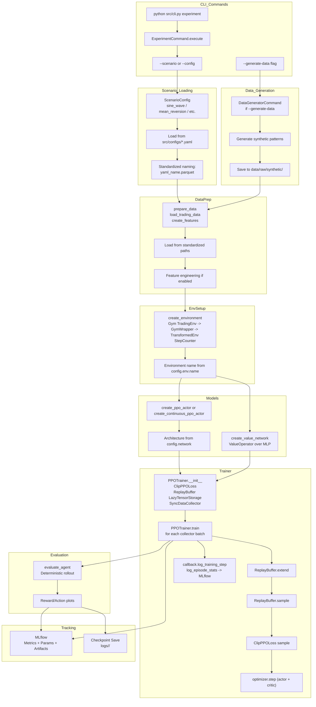
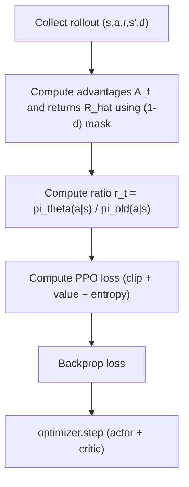

# PPO Implementation Overview

## Summary
- On-policy actor-critic with clipped surrogate objective.
- Supports discrete and continuous action spaces via separate trainers.
- Training uses collector batches, mini-batch updates, and periodic evaluation/logging.

## Core Ideas
- **Clipped Objective**: Limits policy update size via probability ratio clipping.
- **On-Policy Updates**: Uses fresh rollouts with advantage estimates.
- **Entropy Regularization**: Encourages exploration during training.

## Flow

## Optimization Detail

## Math Summary

Let $\pi_\theta(a\mid s)$ be the policy and $V_\phi(s)$ the value function. Define the probability ratio
$$
r_t(\theta) = \frac{\pi_\theta(a_t\mid s_t)}{\pi_{\theta_{\text{old}}}(a_t\mid s_t)}.
$$

**Notation**
- $s_t, a_t, r_t$: state, action, reward at time $t$.
- $\hat{A}_t$: advantage estimate.
- $\hat{R}_t$: return estimate.
- $\epsilon$: clip range.
- $c_1, c_2$: value and entropy coefficients.
- $\theta$: policy parameters; $\phi$: value parameters.

**Clipped surrogate objective**
$$
L^{\text{CLIP}}(\theta) =
\mathbb{E}_t\left[\min\left(r_t(\theta)\hat{A}_t,\ \mathrm{clip}(r_t(\theta), 1-\epsilon, 1+\epsilon)\hat{A}_t\right)\right]
$$

**Value loss**
$$
L^{V}(\phi) = \mathbb{E}_t\left[\left(V_\phi(s_t) - \hat{R}_t\right)^2\right]
$$

**Entropy bonus**
$$
L^{H}(\theta) = \mathbb{E}_t\left[\mathcal{H}(\pi_\theta(\cdot\mid s_t))\right]
$$

**Total objective**
$$
L(\theta,\phi) = L^{\text{CLIP}}(\theta) - c_1 L^{V}(\phi) + c_2 L^{H}(\theta)
$$

## Components
- **CLI + configs**: `ExperimentCommand` loads YAML configs and optionally triggers data generation.
- **Trainer selection**: `PPOTrainer` for discrete envs, `PPOTrainerContinuous` for continuous envs.
- **Loss**: `ClipPPOLoss` with shared Adam optimizer for actor/critic.
- **Collector/buffer**: `SyncDataCollector` + replay buffer for minibatch sampling.

## Training Loop
- Collect batch → extend replay buffer → sample minibatches.
- Compute clipped PPO loss (objective + critic + entropy).
- Backprop and step optimizer; log per-step metrics.
- Periodic buffer stats and evaluation rollouts.

## Continuous Action Notes
- **Actor** uses `TanhNormal` to keep actions in bounds (e.g., `[-1, 1]`).
- **Visualization**: discrete uses stacked action probabilities; continuous uses mean ± std ribbon.
- **Deterministic eval** falls back to `tanh(loc)` for `TanhNormal`.
