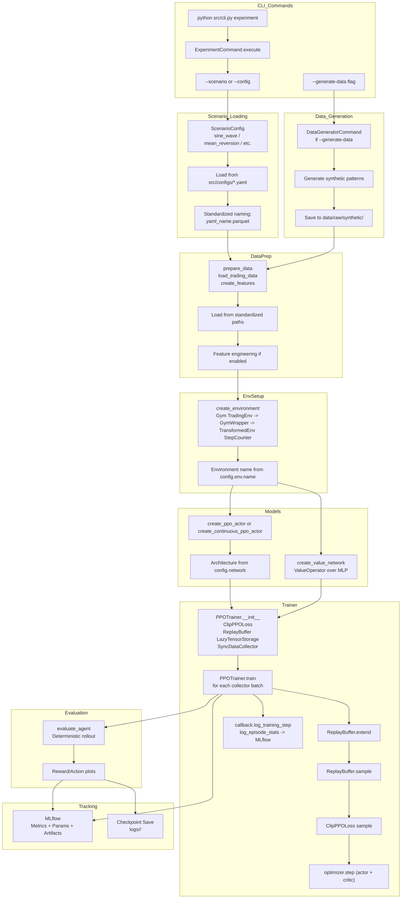
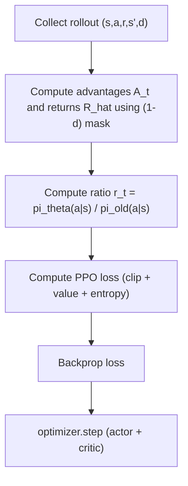

# PPO Implementation Overview

## Summary
- On-policy actor-critic with clipped surrogate objective.
- Supports discrete and continuous action spaces via separate trainers.
- Training uses collector batches, mini-batch updates, and periodic evaluation/logging.

## Core Ideas
- **Clipped Objective**: Limits policy update size via probability ratio clipping.
- **On-Policy Updates**: Uses fresh rollouts with advantage estimates.
- **Entropy Regularization**: Encourages exploration during training.

## Flow

```mermaid
flowchart TD
    subgraph CLI_Commands
        A[python src/cli.py experiment]
        A1[ExperimentCommand.execute]
        A2[--scenario or --config]
        A3[--generate-data flag]
    end

    subgraph Scenario_Loading
        B["ScenarioConfig<br/>sine_wave / mean_reversion / etc."]
        B1[Load from src/configs/*.yaml]
        B2[Standardized naming:<br/>yaml_name.parquet]
    end

    subgraph Data_Generation
        C["DataGeneratorCommand<br/>if --generate-data"]
        C1[Generate synthetic patterns]
        C2[Save to data/raw/synthetic/]
    end

    subgraph DataPrep
        D[prepare_data<br/>load_trading_data<br/>create_features]
        D1[Load from standardized paths]
        D2["Feature engineering if enabled"]
    end

    subgraph EnvSetup
        E["create_environment<br/>Gym TradingEnv -> GymWrapper -> TransformedEnv StepCounter"]
        E1[Environment name from config.env.name]
    end

    subgraph Models
        F["create_ppo_actor or create_continuous_ppo_actor"]
        G["create_value_network<br/>ValueOperator over MLP"]
        F1[Architecture from config.network]
    end

    subgraph Trainer
        H["PPOTrainer.__init__<br/>ClipPPOLoss<br/>ReplayBuffer LazyTensorStorage<br/>SyncDataCollector"]
        I[PPOTrainer.train<br/>for each collector batch]
        J[ReplayBuffer.extend]
        K[ReplayBuffer.sample]
        L["ClipPPOLoss sample"]
        M["optimizer.step (actor + critic)"]
        N[callback.log_training_step<br/>log_episode_stats -> MLflow]
    end

    subgraph Evaluation
        O[evaluate_agent<br/>Deterministic rollout]
        P[Reward/Action plots]
    end

    subgraph Tracking
        Q[MLflow<br/>Metrics + Params + Artifacts]
        R[Checkpoint Save<br/>logs/<experiment>/]
    end

    A --> A1 --> A2
    A2 --> B --> B1 --> B2
    A3 --> C --> C1 --> C2
    B2 --> D --> D1 --> D2
    C2 --> D
    D2 --> E --> E1
    E1 --> F --> F1
    E1 --> G
    F1 --> H
    G --> H
    H --> I
    I --> J --> K --> L --> M
    I --> N
    I --> O --> P --> Q
    I --> Q
    P --> R
```

## Optimization Detail

```mermaid
flowchart TD
    P1["Collect rollout (s,a,r,s',d)"]
    P2["Compute advantages A_t and returns R_hat using (1-d) mask"]
    P3["Compute ratio r_t = pi_theta(a|s) / pi_old(a|s)"]
    P4["Compute PPO loss (clip + value + entropy)"]
    P5["Backprop loss"]
    P6["optimizer.step (actor + critic)"]

    P1 --> P2 --> P3 --> P4 --> P5 --> P6
```

## Math Summary

Let $\pi_\theta(a\mid s)$ be the policy and $V_\phi(s)$ the value function. Define the probability ratio
$$
r_t(\theta) = \frac{\pi_\theta(a_t\mid s_t)}{\pi_{\theta_{\text{old}}}(a_t\mid s_t)}.
$$

**Notation**
- $s_t, a_t, r_t$: state, action, reward at time $t$.
- $\hat{A}_t$: advantage estimate.
- $\hat{R}_t$: return estimate.
- $\epsilon$: clip range.
- $c_1, c_2$: value and entropy coefficients.
- $\theta$: policy parameters; $\phi$: value parameters.

**Clipped surrogate objective**
$$
L^{\text{CLIP}}(\theta) =
\mathbb{E}_t\left[\min\left(r_t(\theta)\hat{A}_t,\ \mathrm{clip}(r_t(\theta), 1-\epsilon, 1+\epsilon)\hat{A}_t\right)\right]
$$

**Value loss**
$$
L^{V}(\phi) = \mathbb{E}_t\left[\left(V_\phi(s_t) - \hat{R}_t\right)^2\right]
$$

**Entropy bonus**
$$
L^{H}(\theta) = \mathbb{E}_t\left[\mathcal{H}(\pi_\theta(\cdot\mid s_t))\right]
$$

**Total objective**
$$
L(\theta,\phi) = L^{\text{CLIP}}(\theta) - c_1 L^{V}(\phi) + c_2 L^{H}(\theta)
$$

## Role in the Thesis Comparison

PPO is the **algorithm-class baseline**: it tests whether on-policy stability compensates for lower sample efficiency on limited HFT data. The AAPL scenario file is `src/configs/scenarios/aapl/ppo_hft_lob_state_space.yaml`.

Network capacity is equalized with TD3 and DDPG for a controlled comparison:

| Parameter | Value |
|-----------|-------|
| Actor hidden dims | [128, 64] |
| Critic hidden dims | [128, 64] |
| Actor hidden activation | Tanh |
| Distribution | TanhNormal(μ, σ) |
| Evaluation action | tanh(μ) — mode of TanhNormal |
| clip_epsilon | 0.2 |
| entropy_bonus | 0.01 |
| vf_coef | 0.5 |
| ppo_epochs | 4 |
| Actor lr / Critic lr | 1e-4 / 1e-4 |

## Components
- **CLI + configs**: `ExperimentCommand` loads YAML configs and optionally triggers data generation.
- **Trainer selection**: `PPOTrainer` for discrete envs, `PPOTrainerContinuous` for continuous envs (triggered automatically when `backend: tradingenv`).
- **Loss**: `ClipPPOLoss` with shared Adam optimizer for actor/critic.
- **Collector/buffer**: `SyncDataCollector`; on-policy so replay buffer is not used for accumulation.

## Training Loop
- Collect fresh rollout → compute advantages → sample minibatches for `ppo_epochs`.
- Compute clipped PPO loss (objective + critic + entropy).
- Backprop and step optimizer; log per-step metrics.
- Periodic evaluation rollouts.

## Continuous Action Notes
- **Actor** (`create_continuous_ppo_actor`) outputs `(loc, scale)` for a `TanhNormal` distribution; actions are sampled during training.
- **Evaluation** uses the mode `tanh(loc)` — deterministic, directly comparable to TD3/DDPG evaluation.
- **Visualization**: continuous uses mean ± std ribbon rather than discrete probability bars.

## See Also

- [Experiment Workflow](./experiment_workflow.md) - End-to-end training workflow
- [DDPG Implementation](./ddpg_implementation_overview.md) - Off-policy deterministic actor-critic
- [TD3 Implementation](./td3_implementation_overview.md) - TD3 with twin critics
- [Data Guide](./data_guide.md) - Data download and generation
- [Trading RL Package](../src/trading_rl/README.md) - Core RL package overview
