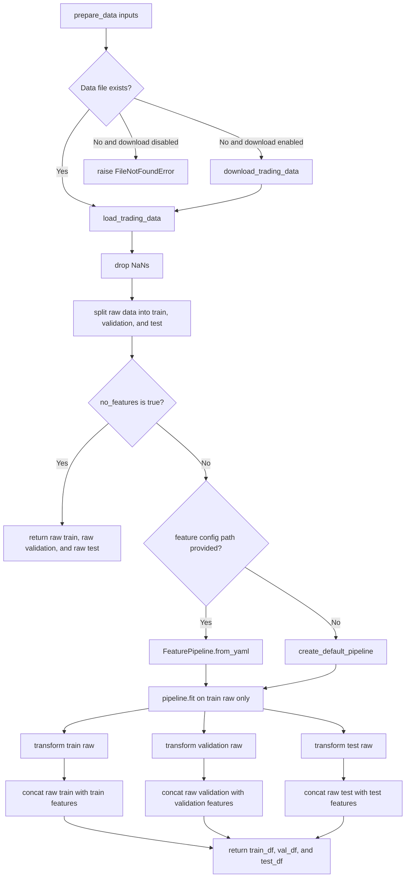

```mermaid
flowchart TD
    A["prepare_data inputs"] --> B{"Data file exists?"}
    B -- "No and download enabled" --> C["download_trading_data"]
    B -- "No and download disabled" --> D["raise FileNotFoundError"]
    B -- "Yes" --> E["load_trading_data"]
    C --> E
    E --> F["drop NaNs"]
    F --> G["split raw data into train, validation, and test"]
    G --> H{"no_features is true?"}
    H -- "Yes" --> I["return raw train, raw validation, and raw test"]
    H -- "No" --> J{"feature config path provided?"}
    J -- "Yes" --> K["FeaturePipeline.from_yaml"]
    J -- "No" --> L["create_default_pipeline"]
    K --> M["pipeline.fit on train raw only"]
    L --> M
    M --> N["transform train raw"]
    M --> O["transform validation raw"]
    M --> P["transform test raw"]
    N --> Q["concat raw train with train features"]
    O --> R["concat raw validation with validation features"]
    P --> S["concat raw test with test features"]
    Q --> T["return train_df, val_df, and test_df"]
    R --> T
    S --> T
```
