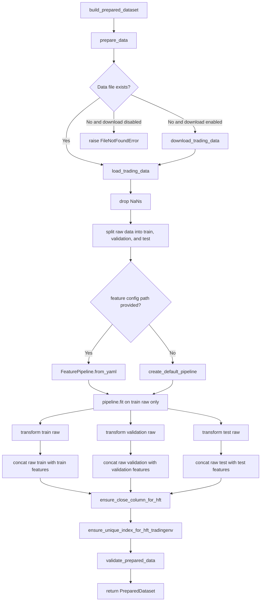

```mermaid
flowchart TD
    A["build_prepared_dataset"] --> B["prepare_data"]
    B --> C{"Data file exists?"}
    C -- "No and download enabled" --> D["download_trading_data"]
    C -- "No and download disabled" --> E["raise FileNotFoundError"]
    C -- "Yes" --> F["load_trading_data"]
    D --> F
    F --> G["drop NaNs"]
    G --> H["split raw data into train, validation, and test"]
    H --> I{"feature config path provided?"}
    I -- "Yes" --> J["FeaturePipeline.from_yaml"]
    I -- "No" --> K["create_default_pipeline"]
    J --> L["pipeline.fit on train raw only"]
    K --> L
    L --> M["transform train raw"]
    L --> N["transform validation raw"]
    L --> O["transform test raw"]
    M --> P["concat raw train with train features"]
    N --> Q["concat raw validation with validation features"]
    O --> R["concat raw test with test features"]
    P --> S["ensure_close_column_for_hft"]
    Q --> S
    R --> S
    S --> T["ensure_unique_index_for_hft_tradingenv"]
    T --> U["validate_prepared_data"]
    U --> V["return PreparedDataset"]
```
