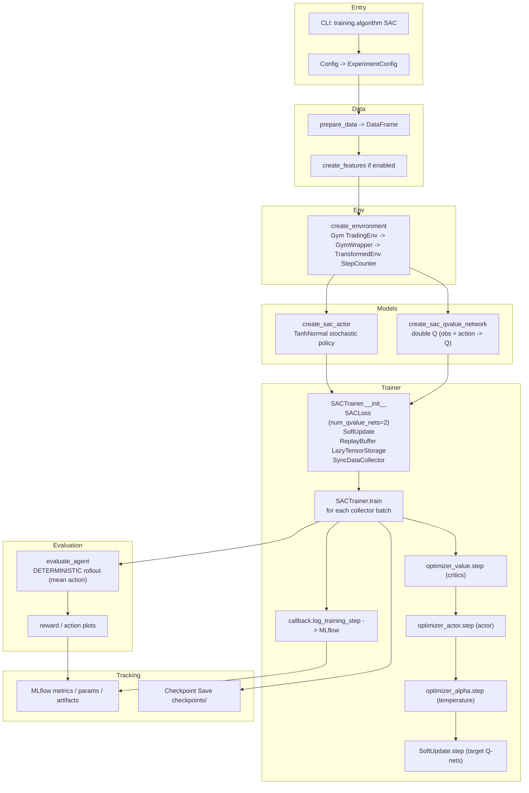
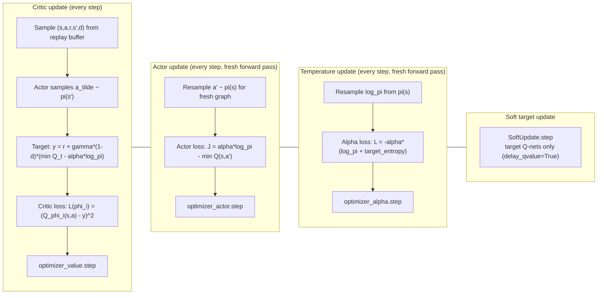

# SAC Implementation Overview

## Summary
- Off-policy actor-critic with maximum-entropy objective.
- Stochastic TanhNormal actor provides built-in exploration; no separate noise module is needed.
- Automatic temperature tuning adjusts the entropy weight `alpha` via a third optimizer.

## Core Ideas
- **Maximum Entropy**: Actor is trained to maximise expected return **plus** entropy, balancing exploitation and exploration.
- **Double Q-Networks**: Two critic networks; minimum prediction is used for target computation to suppress overestimation.
- **Automatic Temperature Tuning**: `alpha` (log-space) is optimised to keep policy entropy near a target threshold (`-n_act` by default).

## Flow



## Optimization Detail



## Math Summary

Let the stochastic actor be $\pi_\theta(a\mid s)$ and critics be $Q_{\phi_1}(s,a),\,Q_{\phi_2}(s,a)$ with targets $Q_{\bar\phi_1},\,Q_{\bar\phi_2}$.

**Notation**

| Symbol | Meaning |
|---|---|
| $s, a, r, s', d$ | state, action, reward, next state, done |
| $\mathcal{B}$ | replay buffer distribution |
| $\gamma$ | discount factor |
| $\tau$ | soft-update coefficient (`training.tau`) |
| $\alpha$ | temperature / entropy weight (learned) |
| $\mathcal{H}$ | entropy of the policy distribution |
| $\bar{\mathcal{H}}$ | target entropy (default: $-n_{\mathrm{act}}$) |

**Soft Q-target (entropy-augmented Bellman)**

$$
y = r + \gamma(1-d)\left[\min_{i=1,2} Q_{\bar\phi_i}(s', \tilde{a}) - \alpha \log\pi_\theta(\tilde{a}\mid s')\right],
\quad \tilde{a}\sim\pi_\theta(\cdot\mid s')
$$

**Critic loss (each network)**

$$
L(\phi_i) = \mathbb{E}_{(s,a,r,s',d)\sim\mathcal{B}}\left[(Q_{\phi_i}(s,a) - y)^2\right]
$$

**Actor loss (maximum entropy)**

$$
J(\theta) = \mathbb{E}_{s\sim\mathcal{B},\,a\sim\pi_\theta}\left[\alpha\log\pi_\theta(a\mid s) - \min_{i}Q_{\phi_i}(s,a)\right]
$$

**Temperature (alpha) loss**

$$
L(\alpha) = \mathbb{E}_{s\sim\mathcal{B},\,a\sim\pi_\theta}\left[-\alpha\left(\log\pi_\theta(a\mid s) + \bar{\mathcal{H}}\right)\right]
$$

**Soft target update (Q-networks only; actor is not delayed)**

$$
\bar\phi_i \leftarrow \tau\phi_i + (1-\tau)\bar\phi_i
$$

## Reference Configuration

Default values from `SACConfig` and the base `TrainingConfig`. No dedicated comparison scenario YAML exists; defaults are used in experiment YAML files that set `training.algorithm: SAC`.

| Parameter | Key | Default |
|---|---|---|
| Actor hidden dims | `network.actor_hidden_dims` | [128, 64] |
| Critic hidden dims | `network.value_hidden_dims` | [128, 64] |
| Actor lr | `training.actor_lr` | 1e-4 |
| Critic lr | `training.value_lr` | 1e-4 |
| Alpha lr | `training.sac.alpha_lr` | 3e-4 |
| Initial alpha | `training.sac.initial_alpha` | 0.2 |
| Target entropy | `training.sac.target_entropy` | `None` → $-n_{\mathrm{act}}$ |
| Soft-update τ | `training.tau` | 0.005 |
| Replay buffer size | `training.buffer_size` | 100,000 |
| Batch size | `training.sample_size` | 128 |
| γ | `training.gamma` | 0.9 |
| Max grad norm | `training.max_grad_norm` | 1.0 |

To override in YAML:

```yaml
training:
  algorithm: SAC
  actor_lr: 1e-4
  value_lr: 1e-4
  tau: 0.005
  sac:
    alpha_lr: 3e-4
    initial_alpha: 0.2
    target_entropy: null   # null → auto: -n_act
```

## Components

- **CLI + configs**: `training.algorithm: SAC` selects `SACTrainer` and calls `SACTrainer.build_models`.
- **Models**: `create_sac_actor` (TanhNormal stochastic policy, same structure as the continuous PPO actor) + `create_sac_qvalue_network` (double Q, same structure as TD3 Q-network) in `src/trading_rl/models.py`.
- **Loss / optimizers**: `SACLoss` (TorchRL) with three separate Adam optimizers — `optimizer_value`, `optimizer_actor`, `optimizer_alpha`. Three sequential forward passes per step avoid computation-graph conflicts between objectives.
- **Collector / buffer**: `SyncDataCollector` + `ReplayBuffer` with `LazyTensorStorage` and random-warmup phase (shared with TD3 via `BaseTrainer`).
- **Temperature**: `SACLoss.log_alpha` is a learnable scalar; `_compute_exploration_ratio` returns `exp(log_alpha)` as an exploration proxy for logging.

## Training Loop

- Collect `frames_per_batch` transitions (stochastic actor used directly — no noise module).
- Extend replay buffer; skip update if below `init_random_frames` warmup threshold.
- For each of `optim_steps_per_batch` update steps:
  1. Sample minibatch from replay buffer; skip if reward contains NaN/Inf or tensor shapes mismatch.
  2. **Critic update**: forward pass → `loss_qvalue` → `optimizer_value.step`.
  3. **Actor update**: fresh forward pass → `loss_actor` → `optimizer_actor.step`.
  4. **Alpha update**: fresh forward pass → `loss_alpha` → `optimizer_alpha.step`.
  5. `SoftUpdate.step` to update target Q-networks (`delay_qvalue=True`; actor targets are not maintained).
- Log `loss_qvalue`, `loss_actor`, `loss_alpha`, `alpha`, and entropy per step.
- Periodic deterministic evaluation on the dedicated eval environment.

## Evaluation

SAC evaluation uses `InteractionType.DETERMINISTIC`, which routes through the `mean` of the TanhNormal distribution rather than sampling. This gives a stable, reproducible policy for metric computation.

## See Also

- [Experiment Workflow](./experiment_workflow.md)
- [PPO Implementation](./ppo_implementation_overview.md)
- [DDPG Implementation](./ddpg_implementation_overview.md)
- [TD3 Implementation](./td3_implementation_overview.md)
- [Data Guide](./data_guide.md)
- [Training Pipeline](./training_pipeline.md)
- [Trading RL Package](../src/trading_rl/README.md)
