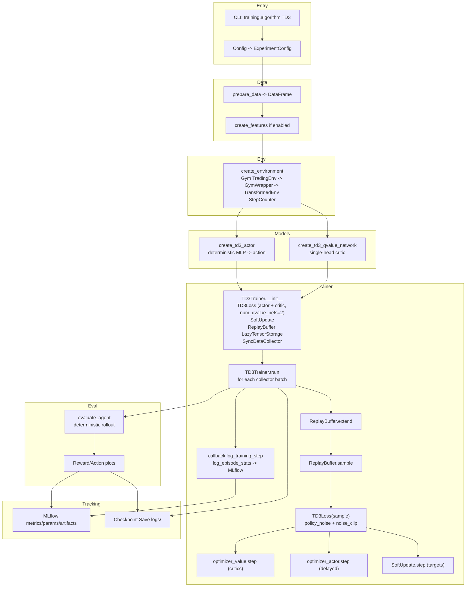

# TD3 Implementation Overview

## Summary
- Off-policy actor-critic with twin critics and target policy smoothing.
- Deterministic actor, critic(s) trained via TD3 loss with delayed policy updates.
- Replay buffer and exploration noise drive sample efficiency.

## Flow

## Core Ideas
- **Twin Critics**: TD3Loss maintains two critic parameter sets and uses the minimum target prediction to curb overestimation.
- **Delayed Policy Updates**: Actor updates happen less frequently than critic updates.
- **Target Policy Smoothing**: Noise is added to target actions during critic updates for regularization.

## Components
- **CLI + configs**: `training.algorithm: TD3` selects TD3 trainer and models.
- **Models**: deterministic actor + critic; TD3Loss expands critic params to two critics.
- **Loss/optimizers**: separate Adam optimizers for actor and critic.
- **Collector/buffer**: `SyncDataCollector` + replay buffer with initial random exploration.

## Training Loop
- Collect batch → replay buffer → sample minibatches.
- Critic update every step; actor update delayed by `policy_delay`.
- Target policy smoothing via `policy_noise` and `noise_clip`.
- Soft-update target params with `tau`.

## Suggested Hyperparameters
- `policy_noise`: 0.2 (relative to action scale)
- `noise_clip`: 0.5
- `delay_actor`: True (actor every 2 critic steps)
- `gamma`: 0.99
- `tau`: 0.005–0.01
- Replay buffer: 1e5–1e6 transitions; batch 64–256

## Integration Notes
- The existing `BaseTrainer` in `src/trading_rl/training.py` handles collection, replay, and logging; a `TD3Trainer` can reuse it similarly to `DDPGTrainer`/`PPOTrainer`.
- Ensure the environment exposes continuous actions (or a discretized wrapper is provided).
- Log both critics’ losses to monitor divergence; watch for action noise magnitude relative to spec bounds.
- Run via CLI by setting `training.algorithm: TD3` in a config (YAML or overrides) and invoking the same entrypoint used for PPO/DDPG (e.g., `python -m trading_rl.train_trading_agent --config path/to/config.yaml`).
