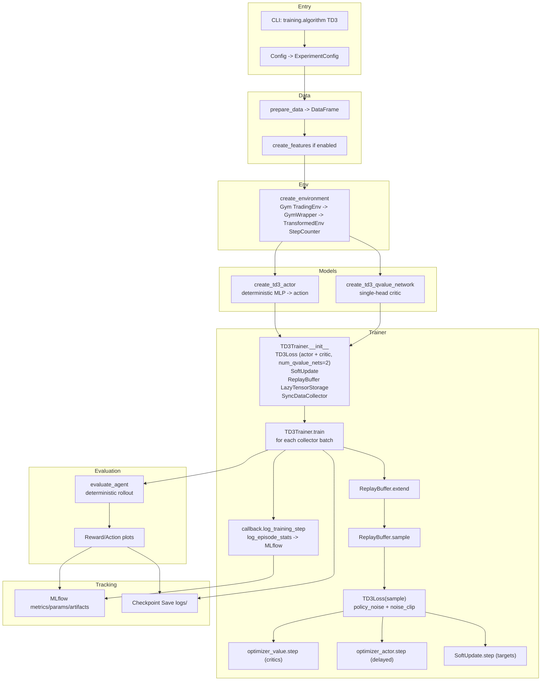

# TD3 Implementation Overview

## Summary
- Off-policy actor-critic with twin critics and target policy smoothing.
- Deterministic actor, critic(s) trained via TD3 loss with delayed policy updates.
- Replay buffer and exploration noise drive sample efficiency.

## Flow

## Core Ideas
- **Twin Critics**: TD3Loss maintains two critic parameter sets and uses the minimum target prediction to curb overestimation.
- **Delayed Policy Updates**: Actor updates happen less frequently than critic updates.
- **Target Policy Smoothing**: Noise is added to target actions during critic updates for regularization.

## Math Summary

Let the actor be $\mu_\theta(s)$ and critics be $Q_{\phi_1}(s,a), Q_{\phi_2}(s,a)$. Target networks are $\mu_{\bar\theta}, Q_{\bar\phi_1}, Q_{\bar\phi_2}$.

**Target policy smoothing**
$$
\tilde{a} = \mu_{\bar\theta}(s') + \epsilon,\quad \epsilon \sim \mathrm{clip}(\mathcal{N}(0,\sigma^2), -c, c)
$$

**Clipped double-Q target**
$$
y = r + \gamma (1-d)\, \min_{i=1,2} Q_{\bar\phi_i}(s', \tilde{a})
$$

**Critic loss (each critic)**
$$
L(\phi_i) = \mathbb{E}_{(s,a,r,s',d)\sim\mathcal{B}} \left( Q_{\phi_i}(s,a) - y \right)^2
$$

**Actor loss (delayed updates)**
$$
J(\theta) = - \mathbb{E}_{s\sim\mathcal{B}} \left[ Q_{\phi_1}(s, \mu_\theta(s)) \right]
$$

**Soft target updates**
$$
\bar\phi \leftarrow \tau \phi + (1-\tau)\bar\phi,\quad
\bar\theta \leftarrow \tau \theta + (1-\tau)\bar\theta
$$

## Components
- **CLI + configs**: `training.algorithm: TD3` selects TD3 trainer and models.
- **Models**: deterministic actor + critic; TD3Loss expands critic params to two critics.
- **Loss/optimizers**: separate Adam optimizers for actor and critic.
- **Collector/buffer**: `SyncDataCollector` + replay buffer with initial random exploration.

## Training Loop
- Collect batch → replay buffer → sample minibatches.
- Critic update every step; actor update delayed by `policy_delay`.
- Target policy smoothing via `policy_noise` and `noise_clip`.
- Soft-update target params with `tau`.

## Integration Notes
- The existing `BaseTrainer` in `src/trading_rl/training.py` handles collection, replay, and logging; a `TD3Trainer` can reuse it similarly to `DDPGTrainer`/`PPOTrainer`.
- Ensure the environment exposes continuous actions (or a discretized wrapper is provided).
- Log both critics’ losses to monitor divergence; watch for action noise magnitude relative to spec bounds.
- Run via CLI by setting `training.algorithm: TD3` in a config (YAML or overrides) and invoking the same entrypoint used for PPO/DDPG (e.g., `python -m trading_rl.train_trading_agent --config path/to/config.yaml`).
