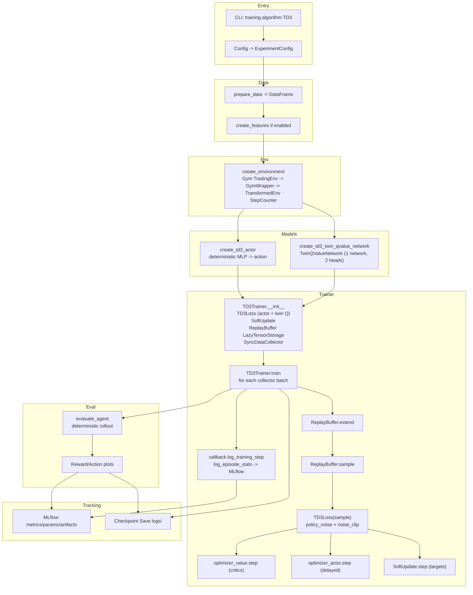

# TD3 Overview

Twin Delayed DDPG (TD3) improves on DDPG by reducing overestimation bias with twin critics and adding target policy smoothing. This project now includes a thin wrapper `TD3Loss` (see `src/trading_rl/training.py`) built on TorchRL’s implementation, ready to plug into a trainer once twin Q networks are provided.

## Core Ideas
- **Twin Critics**: A single Q-network with two heads (a TwinQValueNetwork); the target uses the minimum prediction of the two heads to curb overestimation.
- **Delayed Policy Updates**: Actor updates happen less frequently than critic updates.
- **Target Policy Smoothing**: Noise is added to target actions during critic updates for regularization.

## Minimal Wiring Steps
1. Create a **TwinQValueNetwork** (a single network with two Q-value heads) and a deterministic actor for continuous actions.
2. Instantiate `TD3Loss(actor_network=actor, qvalue_network=twin_q_net, num_qvalue_nets=2, ...)`.
3. Use separate optimizers for actor and the twin critic module; delay actor steps (e.g., every 2 critic steps).
4. Use a replay buffer with random starts, utilizing `RandomPolicy` with a continuous spec initially.
5. Periodically soft-update target networks (tau ≈ 0.005–0.01).

## Suggested Hyperparameters
- `policy_noise`: 0.2 (relative to action scale)
- `noise_clip`: 0.5
- `delay_actor`: True (actor every 2 critic steps)
- `gamma`: 0.99
- `tau`: 0.005–0.01
- Replay buffer: 1e5–1e6 transitions; batch 64–256

## Integration Notes
- The existing `BaseTrainer` in `src/trading_rl/training.py` handles collection, replay, and logging; a `TD3Trainer` can reuse it similarly to `DDPGTrainer`/`PPOTrainer`.
- Ensure the environment exposes continuous actions (or a discretized wrapper is provided).
- Log both critics’ losses to monitor divergence; watch for action noise magnitude relative to spec bounds.
- Run via CLI by setting `training.algorithm: TD3` in a config (YAML or overrides) and invoking the same entrypoint used for PPO/DDPG (e.g., `python -m trading_rl.train_trading_agent --config path/to/config.yaml`).
