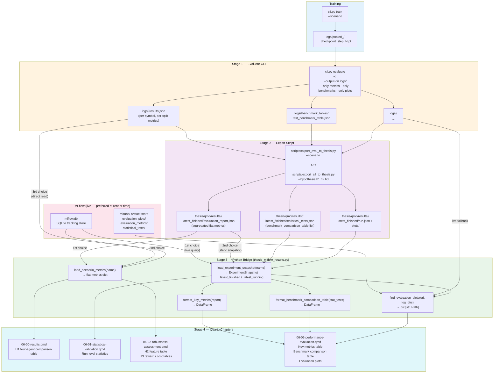

# Thesis Artifact Bridge

This document describes how experiment artifacts (metrics, benchmark tables, plots) flow from the experiment pipeline into the rendered Quarto thesis.

---

## Overview



MLflow is queried first at render time; the static snapshot is the fallback.

---

## Stage 1 — Evaluate CLI

Run `cli.py evaluate` to produce the raw artifacts for a scenario:

```bash
uv run python src/cli.py evaluate \
  -c pooled/td3_hft_lob_state_space_pooled_streaming_selected_dsr \
  --output-dir logs/td3_hft_lob_state_space_pooled_streaming_selected_dsr \
  --only metrics \
  --only benchmarks \
  --only plots
```

This writes into `--output-dir`:

| File | Content |
|---|---|
| `results.json` | Per-symbol, per-split metrics dict |
| `benchmark_tables/test_benchmark_table.json` | Strategy vs benchmark metric rows |
| `benchmark_tables/test_benchmark_table.png` | Rendered benchmark table image |
| `evaluation_data/test_observations_head_5000.parquet` | Feature snapshot for debugging |
| `<split>_<symbol>_reward_plot.png` | Reward curve per symbol |
| `<split>_<symbol>_action_plot.png` | Position/action curve per symbol |

The run scripts (H1/H2/H3) set `--output-dir` automatically based on the scenario name. The directory name is always the last path component of the scenario (e.g. `pooled/td3_hft_lob...` → `logs/td3_hft_lob.../`).

---

## Stage 2 — Export Script

`scripts/export_eval_to_thesis.py` reads Stage 1 output and writes a thesis snapshot:

```bash
uv run python scripts/export_eval_to_thesis.py \
  --scenario pooled/td3_hft_lob_state_space_pooled_streaming_selected_dsr
```

What it does:

1. Locates `logs/<log_name>/results.json` (strips the `pooled/` prefix to find the log dir).
2. Aggregates per-split, per-symbol metrics → one flat dict averaged across all `test_*` splits.
3. Loads `benchmark_tables/test_benchmark_table.json` and converts the `rows` list to the `{"benchmark_comparison_table": [...]}` format expected by the thesis formatter.
4. Copies plot PNGs found in the log dir.
5. Writes the snapshot under `thesis/qmd/results/<experiment_name>/latest_finished/`.

The experiment name is derived by replacing `/` with `_` in the scenario path, so `pooled/td3_hft_lob_state_space_pooled_streaming_selected_dsr` becomes `pooled_td3_hft_lob_state_space_pooled_streaming_selected_dsr`.

### Snapshot layout

```
thesis/qmd/results/<experiment_name>/
├── manifest.json                   ← experiment-level index
└── latest_finished/
    ├── run.json                    ← metadata + file index
    ├── evaluation_report.json      ← flat aggregated metrics (format_key_metrics input)
    ├── statistical_tests.json      ← benchmark comparison table (format_benchmark_comparison_table input)
    ├── params.json                 ← empty (not available from evaluate-only output)
    ├── latest_metrics.json         ← empty (not available from evaluate-only output)
    └── plots/
        ├── rewards.<ext>
        └── positions.<ext>
```

### Batch export

To export all scenarios for one or more hypotheses at once:

```bash
uv run python scripts/export_all_to_thesis.py              # all H1 + H2 + H3
uv run python scripts/export_all_to_thesis.py --hypothesis h1
uv run python scripts/export_all_to_thesis.py --hypothesis h1 h2
```

Scenarios shared across hypotheses (e.g. the baseline) are deduplicated and exported once.

The run scripts (H1/H2/H3) call the single-scenario export automatically as their final step, so a full `bash scripts/run_h1_experiments.sh` already populates the snapshots without a separate manual step.

---

## Stage 3 — Python Bridge Module

`thesis/qmd/src/thesis_mlflow_results.py` is imported by every QMD results chapter. It provides:

### Loading a single experiment snapshot

```python
from thesis_mlflow_results import load_experiment_snapshot

snapshot = load_experiment_snapshot("pooled_td3_hft_lob_state_space_pooled_streaming_selected_dsr")
finished = snapshot.latest_finished   # dict or None
```

`load_experiment_snapshot` tries sources in order:

1. **Live MLflow** — queries `mlflow.db` directly. Returns immediately if a FINISHED run exists.
2. **Static snapshot** — reads `thesis/qmd/results/<name>/latest_finished/run.json`.
3. **Empty** — returns `ExperimentSnapshot` with both slots `None`.

### Loading metrics for multi-scenario comparison tables (H1/H2/H3)

```python
from thesis_mlflow_results import load_scenario_metrics

metrics = load_scenario_metrics("pooled_td3_h3_features_minimal")
# Returns a flat dict: {"sharpe_ratio": 1.23, "total_return": 0.004, ...}
```

`load_scenario_metrics` tries in order:

1. Thesis snapshot `evaluation_report.json` (fastest — no DB round-trip).
2. Live MLflow artifact store.
3. `logs/<log_name>/results.json` read directly (strips the first `_`-delimited component to find the log dir, so `pooled_td3_h3_features_minimal` → `logs/td3_h3_features_minimal/results.json`).

### Formatting helpers

| Function | Input | Output |
|---|---|---|
| `format_key_metrics(report)` | `evaluation_report.json` dict | `pd.DataFrame` with Metric / Value rows |
| `format_benchmark_comparison_table(statistical_tests)` | `statistical_tests.json` dict | `pd.DataFrame` with one row per strategy |
| `load_scenario_metrics(name)` | experiment name string | flat metrics dict |
| `runs_overview_table(name)` | experiment name string | `pd.DataFrame` of all runs |
| `find_evaluation_plots(artifact_uri, log_dirs=...)` | MLflow artifact URI + log dirs | `dict[str, Path]` keyed by plot type |

### Plot resolution

`find_evaluation_plots` checks four locations in priority order:

1. MLflow artifact dir — `evaluation_plots/` (written by training callback)
2. MLflow artifact dir — `evaluation_plots_temp/` (written during periodic eval)
3. Scenario-specific log dirs — `logs/<log_name>/*.png` (written by `evaluate` CLI)
4. `eval_results/` at the repo root (non-specific fallback)

This means plots update automatically on re-render after a new evaluate run, without re-exporting the snapshot.

---

## Stage 4 — QMD Chapters

### Which chapters use the bridge

| File | Experiment name used | Purpose |
|---|---|---|
| `06-00-results.qmd` | `pooled_td3_hft_lob_state_space_pooled_streaming_selected_dsr` | H1 four-agent comparison table + experiment snapshot |
| `06-01-statistical-validation.qmd` | `pooled_td3_hft_lob_state_space_pooled_streaming_selected_dsr` | Run-level statistics table |
| `06-02-robustness-assessment.qmd` | `pooled_td3_hft_lob_state_space_pooled_streaming_selected_dsr` + H2/H3 scenario lists | H2 feature table, H3 reward/cost tables |
| `06-03-performance-evaluation.qmd` | `pooled_td3_hft_lob_state_space_pooled_streaming_selected_dsr` | Key metrics table, benchmark comparison table, plots |

### H1 comparison table pattern (06-00-results.qmd)

Loads `load_scenario_metrics()` for each of the four agents and builds a DataFrame:

```python
H1_AGENTS = [
    ("pooled_td3_hft_lob_state_space_pooled_streaming_selected_dsr",    "TD3"),
    ("pooled_ddpg_hft_lob_state_space_pooled_streaming_selected_dsr",   "DDPG"),
    ("pooled_ppo_hft_lob_state_space_pooled_streaming_selected_dsr",    "PPO"),
    ("pooled_random_hft_lob_state_space_pooled_streaming_selected_dsr", "Random"),
]
```

### H2 / H3 comparison table pattern (06-02-robustness-assessment.qmd)

Same pattern with the relevant scenario names:

```python
# H2 feature sensitivity
H2_SCENARIOS = [
    ("pooled_td3_h3_features_minimal",                           "Minimal (3)"),
    ("pooled_td3_hft_lob_state_space_pooled_streaming_selected", "Selected (10)"),  # baseline
    ("pooled_td3_h3_features_full",                              "Full (33)"),
]

# H3 reward axis
H3_REWARD = [
    ("pooled_td3_hft_lob_state_space_pooled_streaming_selected",     "Log Return"),  # baseline
    ("pooled_td3_hft_lob_state_space_pooled_streaming_selected_dsr", "DSR"),
]

# H3 fee axis
H3_FEES = [
    ("pooled_td3_hft_lob_state_space_pooled_streaming_selected", "0 bp"),  # baseline
    ("pooled_td3_h3_fees_1e6", "0.01 bp"),
    ("pooled_td3_h3_fees_1e5", "0.1 bp"),
    ("pooled_td3_h3_fees_1e4", "1 bp"),
]
```

---

## Keeping thesis results fresh

After any new training or evaluation run, the update sequence is:

```bash
# 1. Evaluate (if not done by the run script)
uv run python src/cli.py evaluate -c <scenario> \
  --output-dir logs/<log_name> \
  --only metrics --only benchmarks --only plots

# 2. Export to thesis snapshot
uv run python scripts/export_all_to_thesis.py --hypothesis h1  # or h2 / h3

# 3. Re-render the thesis
cd thesis/qmd && uv run quarto render
```

If using the run scripts, steps 1 and 2 happen automatically — just run quarto render afterwards.

---

## Scenario name mapping reference

| Scenario (CLI / config) | Log dir | Experiment name (thesis snapshot) |
|---|---|---|
| `pooled/td3_hft_lob_state_space_pooled_streaming_selected_dsr` | `logs/td3_hft_lob_state_space_pooled_streaming_selected_dsr/` | `pooled_td3_hft_lob_state_space_pooled_streaming_selected_dsr` |
| `pooled/ddpg_hft_lob_state_space_pooled_streaming_selected_dsr` | `logs/ddpg_hft_lob_...` | `pooled_ddpg_hft_lob_state_space_pooled_streaming_selected_dsr` |
| `pooled/ppo_hft_lob_state_space_pooled_streaming_selected_dsr` | `logs/ppo_hft_lob_...` | `pooled_ppo_hft_lob_state_space_pooled_streaming_selected_dsr` |
| `pooled/random_hft_lob_state_space_pooled_streaming_selected_dsr` | `logs/random_hft_lob_...` | `pooled_random_hft_lob_state_space_pooled_streaming_selected_dsr` |
| `pooled/td3_hft_lob_state_space_pooled_streaming_selected` | `logs/td3_hft_lob_state_space_pooled_streaming_selected/` | `pooled_td3_hft_lob_state_space_pooled_streaming_selected` |
| `pooled/td3_h3_features_minimal` | `logs/td3_h3_features_minimal/` | `pooled_td3_h3_features_minimal` |
| `pooled/td3_h3_features_full` | `logs/td3_h3_features_full/` | `pooled_td3_h3_features_full` |
| `pooled/td3_h3_fees_1e6` | `logs/td3_h3_fees_1e6/` | `pooled_td3_h3_fees_1e6` |
| `pooled/td3_h3_fees_1e5` | `logs/td3_h3_fees_1e5/` | `pooled_td3_h3_fees_1e5` |
| `pooled/td3_h3_fees_1e4` | `logs/td3_h3_fees_1e4/` | `pooled_td3_h3_fees_1e4` |

The rule: scenario path with `/` replaced by `_` = experiment name = thesis snapshot directory name.

---

## Troubleshooting

**Tables show `—` (all dashes) in QMD**
- Run `uv run python scripts/export_all_to_thesis.py --dry-run` to check which scenarios are missing `results.json`.
- Check that `--output-dir` in the evaluate call matches the expected log dir name.

**Benchmark comparison table is empty**
- The `--only benchmarks` flag must be included in the evaluate call. Without it, `benchmark_tables/` is not written and `statistical_tests.json` is not exported.

**Plots not updating after new evaluate run**
- Plots are resolved live from `logs/<log_name>/` at render time. If they still look stale, check that evaluate was run with `--only plots`.

**MLflow raises "Cannot set a deleted experiment as active"**
- The experiment was soft-deleted. Permanently remove it so the name can be reused:
  ```bash
  uv run python src/cli.py experiments --purge --delete "<name_regex>"
  ```

**`load_scenario_metrics` returns empty dict**
- Check all three fallback sources: thesis snapshot exists at `thesis/qmd/results/<name>/latest_finished/evaluation_report.json`, MLflow has a FINISHED run, or `logs/<log_name>/results.json` exists.
- The log name is derived by stripping the first `_`-delimited component: `pooled_td3_h3_features_minimal` → looks in `logs/td3_h3_features_minimal/`.
