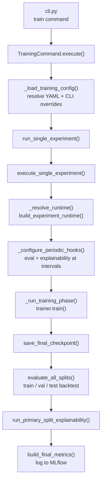
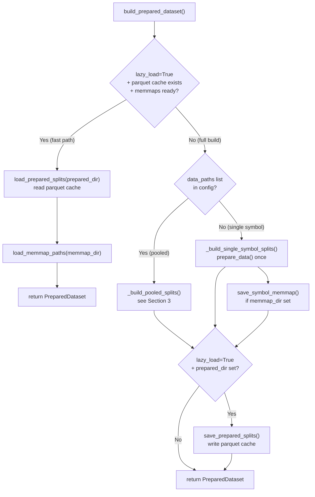
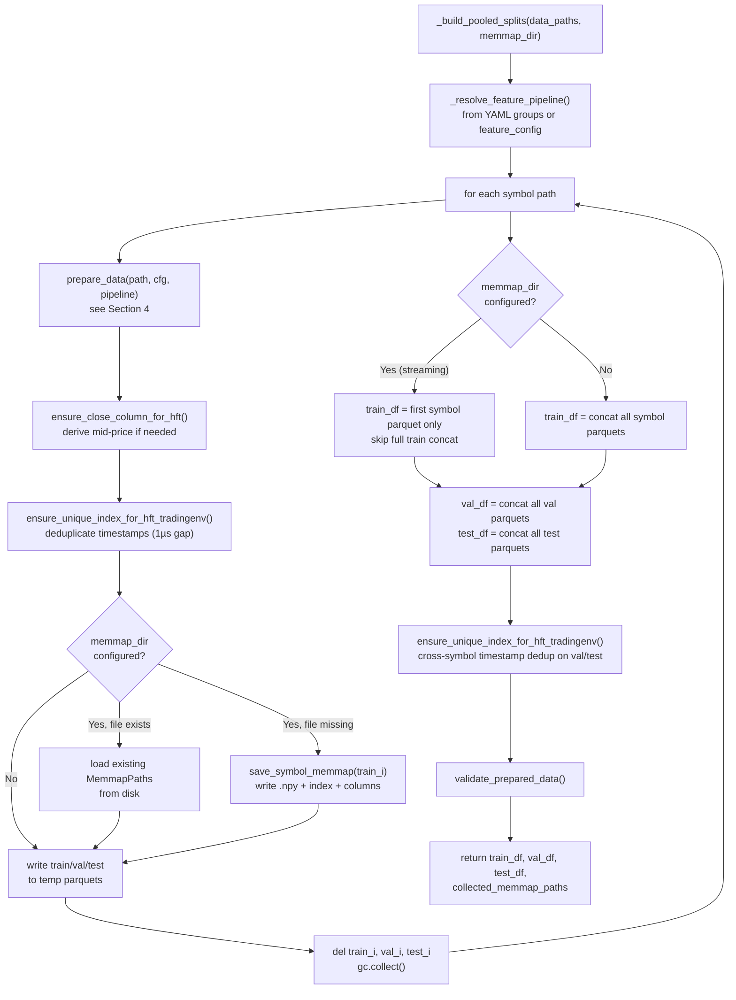
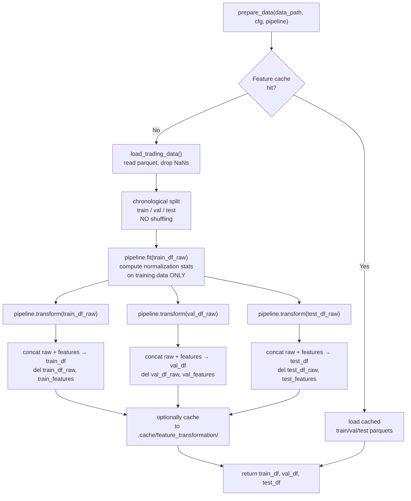
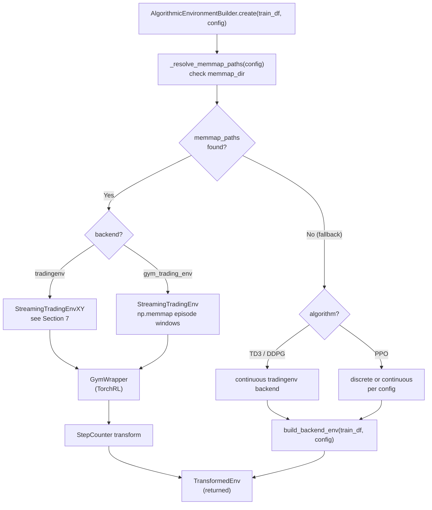
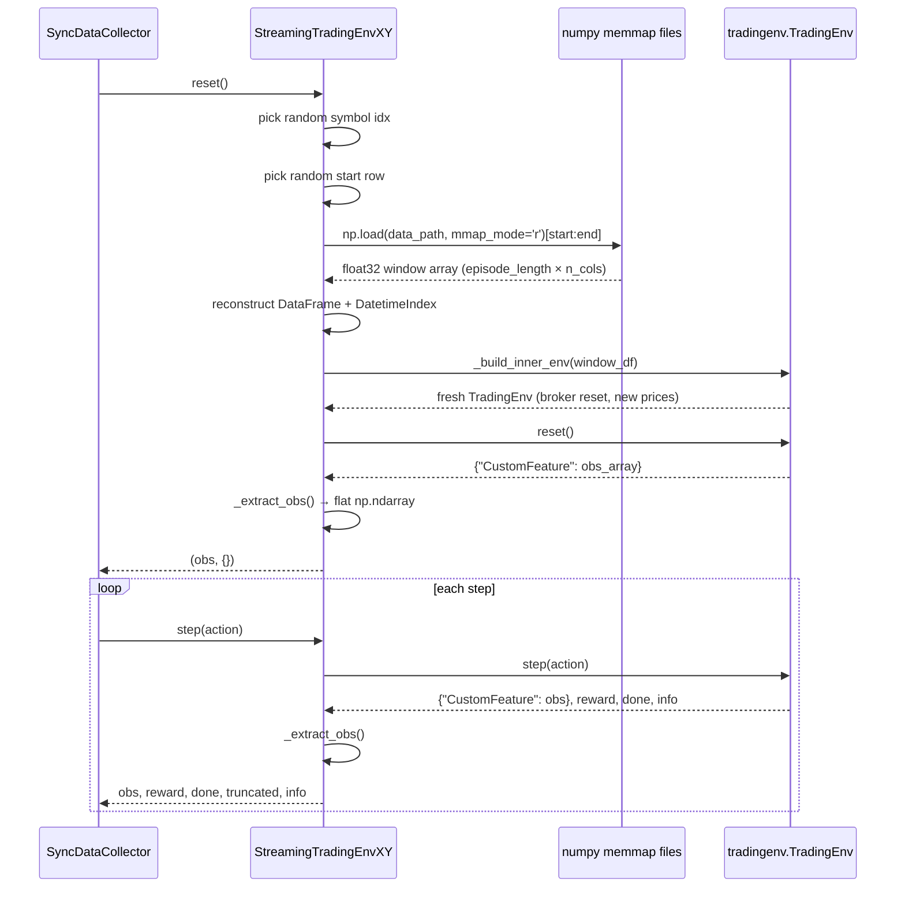
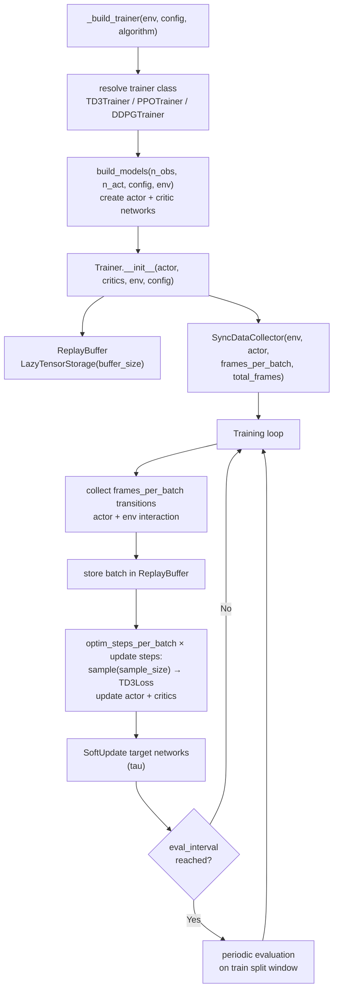
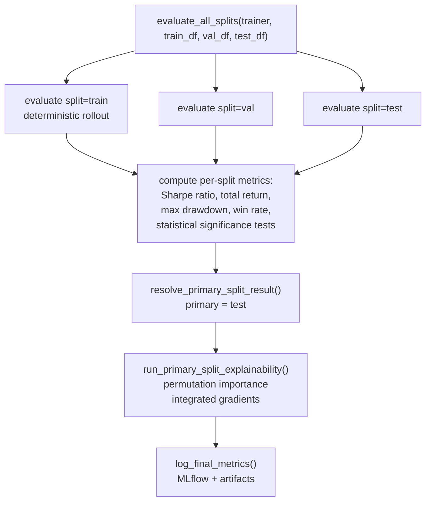

# Training Pipeline Architecture

End-to-end reference for the training pipeline, from CLI invocation to final evaluation.

---

## 1. Top-Level Flow



---

## 2. Data Loading: `build_prepared_dataset`

Two paths exist depending on whether a prepared parquet cache is already on disk.



**`PreparedDataset` fields:**

| Field | Content |
|---|---|
| `train_df` | First symbol's train split (streaming mode) or full concat |
| `val_df` | All symbols' val splits concatenated |
| `test_df` | All symbols' test splits concatenated |
| `memmap_train_paths` | List of `MemmapPaths` per symbol, or `None` |
| `feature_columns` | `feature_*` column names |
| `price_column` | Column used for portfolio valuation |

---

## 3. Pooled Multi-Symbol Data Build: `_build_pooled_splits`

Peak memory stays at ~1 symbol at a time during feature engineering.



---

## 4. Per-Symbol Feature Engineering: `prepare_data`

**Critical invariant: split before fit — no future data leaks into normalization.**



The feature pipeline uses **Welford's online algorithm** for cumulative running normalization — statistics are updated per-event so the scaler at step $t$ has only seen events $1..t$. Statistics reset at session boundaries (gaps > 1 hour).

---

## 5. Memmap Storage Format

A memory-mapped file lets the OS map bytes on disk directly into the process address space. Only the pages you actually read are loaded into RAM, so the full 200k-row train array stays on disk and each episode reads only its 50k-row window.

```mermaid
flowchart LR
    RAW["Raw parquet\n~7M tick events\n(4 trading days)"]
    SPLIT["Chronological split\ntrain: first train_size rows\nval + test: remainder"]
    FIT["Feature pipeline\nfit on train only"]
    NP["float32 array\nsaved to disk:\n{i}_train_data.npy"]
    MM["Memmap on disk\n(not loaded into RAM)"]
    RESET["reset()\npick random start\nin [0, train_size − episode_length]"]
    WINDOW["Episode window\nepisode_length rows\n(only this slice in RAM)"]
    ENV["TradingEnv\nwraps window as DataFrame"]
    AGENT["Agent steps\nthrough episode"]

    RAW --> SPLIT
    SPLIT --> FIT
    FIT --> NP
    NP --> MM
    MM --> RESET
    RESET --> WINDOW
    WINDOW --> ENV
    ENV --> AGENT
```



With `train_size=200_000` and `episode_length=50_000` there are at most 150k possible start offsets, giving a sliding window of episode positions. With 2M training steps at 200 frames/batch, the agent visits many overlapping windows across the full 200k training rows.

Each symbol produces three files in `memmap_dir/`:

```
{i}_train_data.npy     float32 array, shape (n_rows, n_cols)
{i}_train_index.npy    int64 array,   shape (n_rows,)  — nanosecond timestamps
{i}_columns.json       list[str]      — column names
```

`MemmapPaths` records `data_path`, `index_path`, `n_rows`, and `columns`.

---

## 6. Environment Construction: `AlgorithmicEnvironmentBuilder.create()`



---

## 7. Streaming Episode Sampling: `StreamingTradingEnvXY`

On every `reset()` a fresh episode window is sampled from a random symbol.
Peak memory ≈ `episode_length × n_features × 4 bytes`.



---

## 8. Trainer Setup and TD3 Training Loop



**TD3-specific details:**
- Two independent Q-networks to reduce overestimation bias
- Policy delay: actor updates every `policy_delay` critic updates (default 2)
- Target policy smoothing: Gaussian noise clipped to `noise_clip` added to target actions
- Exploration: Gaussian noise with std `exploration_noise_std` during collection

---

## 9. Post-Training Evaluation



---

## 10. Cache and Artifact Locations

| Path | Content |
|---|---|
| `data/raw/stocks/` | Raw MBP-10 parquet files from DataBento |
| `data/prepared/{name}/` | Cached train/val/test parquets (lazy_load fast path) |
| `data/memmap/{name}/` | Per-symbol numpy memmap arrays for streaming |
| `.cache/feature_transformation/` | Per-symbol feature engineering cache (keyed by file hash + config hash) |
| `mlruns/` | MLflow experiment tracking |
| `checkpoints/` | Model checkpoints (weights + optimizer state) |
