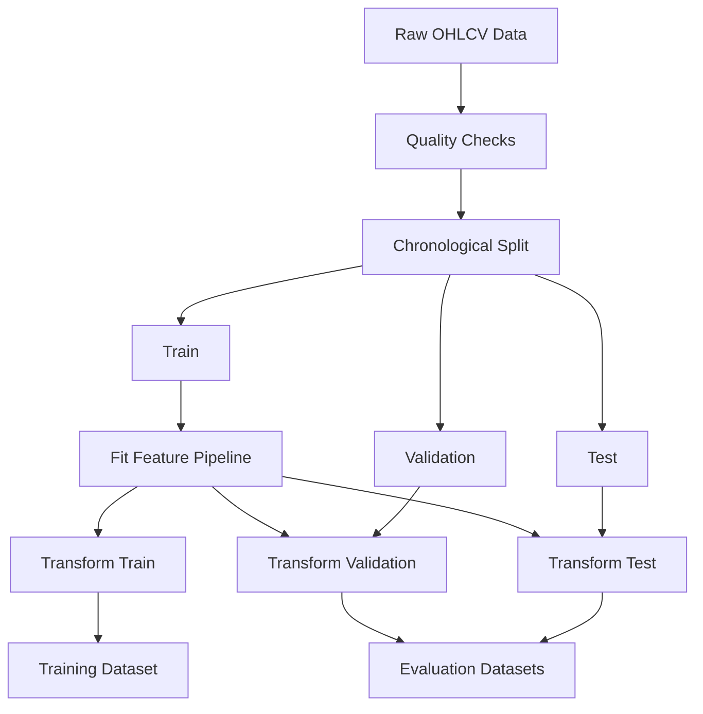

## Data Preparation

### Data Collection and Input Format

The data preparation layer in this research is designed for time-indexed OHLCV
market data, where each row represents an aggregated market bar for a given
timeframe. This representation is appropriate for the empirical scope of the
implemented reinforcement learning workflow because it supports sequential
decision-making while remaining computationally tractable for repeated
experiments, hyperparameter tuning, and feature ablation studies.

The expected input format consists of a timestamp index and five core columns:
open, high, low, close, and volume. These variables provide a compact but
expressive summary of market behavior over each interval and support the
construction of return, volatility, volume, and technical-indicator features.
The timestamp index is required not only for chronological ordering, but also
for temporal feature engineering (for example, cyclical encodings of hour-of-day
or day-of-week effects).

In the implemented workflow, the timeframe is scenario-dependent (for example,
hourly bars). Timeframe choice is methodologically important because it affects
both the statistical structure of the data and the meaning of the features.
Temporal features that are informative at one resolution may be constant or
uninformative at another. For this reason, feature selection is treated as a
data-preparation decision and not only as a model-level hyperparameter.

Table: Expected OHLCV input schema used in the empirical pipeline

| Column | Description | Role in pipeline |
|---|---|---|
| `timestamp` | Chronological index of each market bar | Ordering, splitting, temporal features |
| `open` | Opening price within the bar | Feature engineering input |
| `high` | Highest price within the bar | Feature engineering input |
| `low` | Lowest price within the bar | Feature engineering input |
| `close` | Closing price within the bar | Pricing, rewards, and feature engineering |
| `volume` | Traded volume within the bar | Volume and liquidity feature engineering |

### Data Quality Control and Preprocessing

Before any feature engineering or model training is performed, the dataset
undergoes a preprocessing stage focused on chronological integrity and basic
sanity checks. The first requirement is strict temporal ordering. Because the
research problem is sequential, any disorder in timestamps can introduce
artificial transitions and invalidate the interpretation of rewards and actions.

The preprocessing stage also checks for structural consistency, including the
presence of required columns, valid numeric types, and a non-empty dataset.
Price columns are expected to contain positive values in the context of the
trading simulation, since negative or zero prices are incompatible with
portfolio valuation and return calculations. Missing values and malformed rows
are handled before feature generation so that the downstream feature pipeline
operates on a coherent input structure.

This stage is intentionally conservative. Its purpose is not to perform
aggressive statistical filtering that could distort the data-generating process,
but to ensure that the dataset is technically valid for subsequent
transformations and simulation. More specialized cleaning rules may be added in
future work, but they should remain explicitly documented because they can alter
the empirical conclusions.

### Chronological Splitting Strategy

The dataset is split chronologically into training, validation, and test
subsets. Chronological splitting is essential in financial research because
shuffling would allow information from the future to influence earlier training
samples, thereby violating causality and inflating apparent performance.

The training split is used to fit model parameters and any preprocessing
components that require estimated statistics. The validation split supports
configuration comparison and development-time diagnostics, including feature-set
selection and hyperparameter tuning. The test split is reserved for final
out-of-sample reporting and should not influence model selection decisions.

This division serves both statistical and methodological purposes. Statistically,
it provides a more realistic estimate of generalization in a non-stationary
setting. Methodologically, it enforces discipline in the experimental process by
separating model development from final performance claims.

The implemented workflow treats split feasibility as a first-class validation
concern. Invalid split settings, such as a training segment that consumes the
entire dataset or leaves an empty evaluation segment, are handled before
training begins. This fail-fast behavior is particularly important in
experimental workflows where many predefined scenarios may be tested in
sequence.

### Feature Engineering Pipeline

Feature engineering is governed by an external feature pipeline. Rather than
hard-coding feature transformations inside the training logic, the workflow
defines feature sets declaratively. The broader methodological rationale is
introduced in Chapter 1.3; here, the focus is on implementation details relevant
to data preparation.

The feature pipeline supports multiple feature families derived from OHLCV data,
including:

- return and momentum features (for example, lagged returns or transformed
  returns),
- volatility-related features (for example, realized volatility or volatility
  ratios),
- volume and liquidity proxies,
- technical indicators,
- temporal and cyclical context features.

A key design choice in the implemented workflow is the use of feature-derived
observation columns for learning. The state representation passed to the agent
is composed of engineered feature variables, while raw market prices remain
available separately for portfolio valuation and reward calculation. This
feature-only observation design improves clarity and reduces the likelihood of
mixing normalized learning inputs with financial pricing logic.

The same setup also enables feature ablation studies. For example, the research
can compare a comprehensive feature set with a reduced, non-redundant subset
while keeping the rest of the experimental setup unchanged.
This is particularly useful in reinforcement learning, where redundant features
can increase critic noise and hinder stable convergence.

### Feature Normalization and Leakage Prevention

Feature normalization is handled within the feature pipeline and follows a
chronology-preserving protocol. Any normalization or scaling transformation that
requires fitted parameters is estimated using the training split only. The same
fitted transformation is then applied to the validation and test splits.

This ordering is a central anti-leakage mechanism. If normalization were fit on
the full dataset, information from future volatility regimes or distributional
changes could influence the representation seen during training, leading to
optimistic and methodologically invalid results.

Not all features require normalization. Temporal cyclical encodings such as sine
and cosine representations of hour-of-day or day-of-week are already bounded and
structured, and may be left unnormalized by design. This is consistent with the
goal of preserving their geometric interpretation as phase encodings on a
circular domain.

Equally important, raw price columns used for portfolio accounting are not
replaced by normalized values. The simulation environment requires financially
meaningful prices to compute returns, portfolio valuation, and transaction cost
effects. Normalization is therefore applied to learning features, not to the
pricing inputs used by the trading mechanics.

### Observation/Price Column Separation

A methodological distinction is maintained between two categories of data used
by the trading system:

- price inputs used for portfolio valuation and reward simulation,
- feature inputs used as the state representation for the learning algorithm.

This separation is not merely an implementation preference; it is a correctness
constraint. The trading simulation must operate on economically interpretable
price data, while the learning algorithm benefits from transformed and
normalized state variables. Combining these roles in a single set of columns can
lead to errors in portfolio accounting, invalid reward calculations, or
unintended use of normalized prices in financial metrics.

By separating price and feature inputs, the workflow also improves
interpretability. It becomes possible to reason about the state representation as
a modelling choice (feature design), while retaining a clear definition of the
market prices driving portfolio returns and benchmark comparisons.

### Configuration-Driven Feature Selection

Feature selection is implemented as a scenario-level research control. Different
experimental scenarios can specify alternative feature subsets without changing
the training code. This supports structured comparison across:

- broad feature sets designed for coverage,
- reduced feature sets designed to minimize redundancy,
- specialized feature sets tailored to a specific market regime or hypothesis.

This design is particularly useful in reinforcement learning because the quality
of the state representation materially affects critic stability, policy learning,
and sample efficiency. A larger feature set does not automatically imply better
performance. Redundant indicators, especially those encoding similar market
properties at similar horizons, may increase noise and impair generalization.

Consequently, feature selection is treated as part of the empirical methodology
rather than a purely technical preprocessing step. Scenario-based feature
selection makes this dependency explicit and facilitates reproducible ablation
experiments.

### Data Validation Before Training

Before training begins, the workflow performs a dedicated validation stage on
the configuration and data setup. The purpose of this stage is to detect
structural incompatibilities early and prevent wasted computation.

The validation stage conceptually includes the following checks:

- dataset path availability and readability,
- feature-pipeline configuration validity,
- split feasibility for the available dataset size,
- existence of referenced observation features after feature generation,
- compatibility between selected pricing columns, selected feature columns, and
  the prepared dataset.

When a structural issue is identified, the workflow adopts a fail-fast strategy
for hard errors, especially where proceeding would invalidate the experiment or
cause runtime failures later in training. This improves the reliability and
repeatability of the overall research process.

### Summary

The data preparation layer in this thesis is designed to support reproducible
and leakage-aware reinforcement learning experiments on OHLCV market data. Its
core principles are chronological integrity, split-before-fit preprocessing,
feature-pipeline modularity, and strict separation between pricing inputs and
learning features. Together, these choices provide a sound methodological basis
for the algorithm-specific training and evaluation procedures described in later
chapters.

