```{=latex}
\appendix
% Annex D p. 16 opens the appendix content with its own heading ("ANNEXES")
% before the first appendix, matching the "APPENDICES" line its contents
% carries. The appendices here began straight at "A. FEATURE INVENTORY"
% with nothing marking where the block starts. Unnumbered, so it does not
% consume an appendix letter, and added to the contents by hand since
% \section* writes no entry.
\clearpage
\section*{APPENDICES}
\addcontentsline{toc}{section}{APPENDICES}
% Annex D's contents ends "BIBLIOGRAPHY 72 / LIST OF INDEXES 75 / APPENDICES
% 77" -- one line for the whole block, with no per-appendix breakdown. The
% individual appendices belong to the list of appendices ("Annex 1.",
% "Annex 2." there), and requirement 3 asks the contents to carry chapter and
% subchapter titles, which appendices are not. Listing A through K in both
% places duplicated the list of appendices two pages earlier.
%
% Lowering tocdepth inside the .toc file suppresses the entries when the
% contents is typeset, rather than preventing them being written. The appendix
% headings therefore keep their numbering and their \addcontentsline{lap}
% entries, and only the contents stops showing them. This goes after the
% APPENDICES line above, or that line would be suppressed too. Nothing follows
% the appendices, so the depth never needs restoring.
\addtocontents{toc}{\protect\setcounter{tocdepth}{-1}}
```

# Feature Inventory

```{=latex}
\addcontentsline{lap}{appendices}{\protect\numberline{\thesection}Feature Inventory}
```

```{python}
#| label: validate-feature-table-citations
#| echo: false
#| warning: false

# The feature table below is a raw LaTeX longtable, so Pandoc cannot process
# @key citations inside it and its Citation column is written by hand. This
# guard compares every one of those cells against the text derived from
# library.bib and fails the render on any disagreement, which is how the
# "Cao et al. (2004)" / 2009 drift reached the submitted document unnoticed.
from feature_table_citations import validate_table

_citation_problems = validate_table("99-appendix.qmd")
if _citation_problems:
    raise ValueError(
        "Feature table citations disagree with library.bib:\n  "
        + "\n  ".join(_citation_problems)
    )
```

The tables below catalogue every feature type implemented in the feature
registry. The subset used in the main
state-space experiment is marked in the **In model** column: $\checkmark$ indicates
all variants are used, while a specific parameter value indicates only that
variant is used.
Feature names match the keys produced by the feature pipeline at runtime.

The ten static LOB features used in the main HFT experiment are z-score
normalized with causal running statistics that are updated chronologically and
reset at detected session boundaries. The runtime position feature is appended
by the environment and remains in its raw bounded scale $[-1, 1]$. The cyclical
time encodings listed in the registry are inherently bounded but are not part of
the selected TD3 specification.

## LOB Microstructure Features

**Notation.**

- $P^{bid}_i$, $P^{ask}_i$: bid/ask price at book level $i$
- $V^{bid}_i$, $V^{ask}_i$: resting volume at level $i$
- $C^{bid}_i$, $C^{ask}_i$: order count at level $i$
- $M_t = \tfrac{1}{2}(P^{bid}_0+P^{ask}_0)$: mid-price
- $S_t = P^{ask}_0-P^{bid}_0$: spread
- $\mathrm{QWM}_t = \tfrac{V^{ask}_0P^{bid}_0+V^{bid}_0P^{ask}_0}{V^{bid}_0+V^{ask}_0}$: queue-weighted midpoint (legacy feature name `microprice`)
- $\bar{P}^{vw}_N = \tfrac{\sum_{i<N}(P^{bid}_i V^{bid}_i + P^{ask}_i V^{ask}_i)}{\sum_{i<N}(V^{bid}_i+V^{ask}_i)}$: volume-weighted mid-price over the top $N$ levels
- $\Delta V^{bid}_t = V^{bid}_{0,t}-V^{bid}_{0,t-1}$, $\Delta V^{ask}_t = V^{ask}_{0,t}-V^{ask}_{0,t-1}$: tick-to-tick volume change
- $e^{bid}_t = V^{bid}_{0,t}\mathbf{1}[P^{bid}_{0,t}>P^{bid}_{0,t-1}] + \Delta V^{bid}_t\,\mathbf{1}[P^{bid}_{0,t}=P^{bid}_{0,t-1}] - V^{bid}_{0,t-1}\mathbf{1}[P^{bid}_{0,t}<P^{bid}_{0,t-1}]$, $e^{ask}_t = V^{ask}_{0,t}\mathbf{1}[P^{ask}_{0,t}<P^{ask}_{0,t-1}] + \Delta V^{ask}_t\,\mathbf{1}[P^{ask}_{0,t}=P^{ask}_{0,t-1}] - V^{ask}_{0,t-1}\mathbf{1}[P^{ask}_{0,t}>P^{ask}_{0,t-1}]$: best-level order-flow events, which contribute the full standing queue when the quote moves and only the increment when it holds [@Cont2014]
- $\mathrm{OFI}_t = e^{bid}_t - e^{ask}_t$: best-level order flow imbalance
- $W$: rolling-window length in events
- $\mathcal{W}_t=\{t-W+1,\ldots,t\}$: event indices in the rolling window ending at $t$
- $\bar{x}_W$: rolling mean over $W$ events
- $V^B_W$, $V^S_W$: rolling buy/sell volume over $W$ events
- $L$: odd-lot size threshold (100 shares)
- $Q$: notional or size threshold
- $h_t$: hour of day (0–23)
- $\Delta t_{\text{ns}}$: inter-event time in nanoseconds
- $\mathbf{1}[\cdot]$: indicator function
- $\hat{\rho}(\cdot,\text{lag}=1)$: sample autocorrelation at lag 1

```{=latex}
\begin{landscape}
% This table already sets \footnotesize. Its six p{} columns sum to 0.92 of
% \linewidth, and the seven inter-column gaps at the default 6 pt \tabcolsep
% add another ~30 mm, which together pushed it 4.7 mm past the right margin.
% Requirement 10 fixes all margins at 25 mm. Tightening \tabcolsep recovers
% the space without touching the column fractions or the type size.
\setlength{\tabcolsep}{3pt}
\footnotesize
\begin{longtable}{p{0.18\linewidth} p{0.09\linewidth} p{0.32\linewidth} p{0.11\linewidth} >{\centering\arraybackslash}p{0.07\linewidth} p{0.15\linewidth}}
\caption{Full LOB feature registry with formulas and citations.\label{tbl-lob-features}} \\
\toprule
Feature & Group & Formula & Param & In model & Citation \\
\midrule
\endfirsthead
\multicolumn{6}{l}{\footnotesize\textit{Table \ref{tbl-lob-features} continued.}} \\
\toprule
Feature & Group & Formula & Param & In model & Citation \\
\midrule
\endhead
\bottomrule
\endlastfoot
\texttt{hft\_book\_pressure} & Imbalance & $(V^{bid}_i - V^{ask}_i)/(V^{bid}_i + V^{ask}_i)$ & $i \in \{0,1,2\}$ & level 0 & Cao et al.\ (2009); Biais et al.\ (1995) \\
\texttt{hft\_order\_book\_imbalance} & Imbalance & $\dfrac{\sum_{i<N}(V^{bid}_i-V^{ask}_i)}{\sum_{i<N}(V^{bid}_i+V^{ask}_i)}$ & $N=3$ & $\checkmark$ & Cont et al.\ (2014) \\
\texttt{hft\_order\_count\_imbalance} & Imbalance & $(C^{bid}_i-C^{ask}_i)/(C^{bid}_i+C^{ask}_i)$ & $i=0$ & level 0 & Biais et al.\ (1995) \\
\texttt{hft\_microprice} & Fair value & $\mathrm{QWM}_t$ & --- & $\checkmark$ & Stoikov (2018) \\
\texttt{hft\_microprice\_divergence} & Fair value & $\mathrm{QWM}_t-M_t$ & --- & $\checkmark$ & --- \\
\texttt{hft\_vwmp\_skew} & Fair value & $(\bar{P}^{vw}_N - M_t)/S_t$ & $N=3$ & & --- \\
\texttt{hft\_price\_vamp} & Fair value & Avg.\ execution price for fixed-notional order walked through $N$ levels & \mbox{$Q\in\{1k,5k\}$} & & --- \\
\texttt{hft\_depth\_ratio} & Depth & $(V^{bid}_0+V^{ask}_0)\,/\,\sum_{i=1}^{N}(V^{bid}_i+V^{ask}_i)$ & $N=4$ & & Bouchaud et al.\ (2002) \\
\texttt{hft\_spread\_bps} & Spread/cost & $(P^{ask}_0-P^{bid}_0)/M_t \times 10{,}000$ & --- & & Kyle (1985); Glosten \& Milgrom (1985) \\
\texttt{hft\_spread\_ratio} & Spread/cost & $\mathrm{SpreadBps}_t\,/\,\bar{\mathrm{SpreadBps}}_W$ & $W=50$ & & Easley et al.\ (2012) \\
\texttt{hft\_bid\_convexity} & Spread/cost & $(P^{bid}_0-P^{bid}_1)-(P^{bid}_1-P^{bid}_2)$ & bid & & Bouchaud et al.\ (2002) \\
\texttt{hft\_ask\_convexity} & Spread/cost & $(P^{ask}_2-P^{ask}_1)-(P^{ask}_1-P^{ask}_0)$ & ask & & Bouchaud et al.\ (2002) \\
\texttt{hft\_bid\_slope} & Spread/cost & $(P^{bid}_0-P^{bid}_4)\,/\,\sum_{i<5}V^{bid}_i$ & 5 levels & $\checkmark$ & Bouchaud et al.\ (2002); Kyle (1985) \\
\texttt{hft\_ask\_slope} & Spread/cost & $(P^{ask}_4-P^{ask}_0)\,/\,\sum_{i<5}V^{ask}_i$ & 5 levels & $\checkmark$ & Bouchaud et al.\ (2002); Kyle (1985) \\
\texttt{hft\_ofi} & Order flow & $\mathrm{OFI}_t = e^{bid}_t - e^{ask}_t$ & --- & $\checkmark$ & Cont et al.\ (2014) \\
\texttt{hft\_ofi\_rolling} & Order flow & $\sum_{\tau\in\mathcal{W}_t}\mathrm{OFI}_\tau$ & $W=50$ & $W=50$ & Cont et al.\ (2014) \\
\texttt{hft\_ofi\_multilevel} & Order flow & $\sum_{i<N}\mathrm{OFI}^{(i)}_t$ (event classification at each level $i$) & \mbox{$N\in\{3,5\}$} & & Cont et al.\ (2014) \\
\texttt{hft\_bid\_queue\_depletion} & Order flow & $\max(V^{bid}_{0,t-1}-V^{bid}_{0,t},\,0)\,/\,V^{bid}_{0,t-1}$ & bid & & Foucault et al.\ (2005) \\
\texttt{hft\_ask\_queue\_depletion} & Order flow & $\max(V^{ask}_{0,t-1}-V^{ask}_{0,t},\,0)\,/\,V^{ask}_{0,t-1}$ & ask & & Foucault et al.\ (2005) \\
\texttt{hft\_signed\_trade\_flow} & Order flow & $\sum_{\tau\in\mathcal{W}_t}\mathrm{size}_\tau\cdot(\mathbf{1}[\mathrm{side}_\tau=\mathrm{B}]-\mathbf{1}[\mathrm{side}_\tau=\mathrm{A}])$ & $W=50$ & $W=50$ & Lee \& Ready (1991) \\
\texttt{hft\_odd\_lot\_trade\_ratio} & Order flow & $\sum_{\tau\in\mathcal{W}_t}\mathbf{1}[\mathrm{trade}_\tau\wedge\mathrm{size}_\tau<L]\,/\,\sum_{\tau\in\mathcal{W}_t}\mathbf{1}[\mathrm{trade}_\tau]$ & $W=200$ & & Boehmer et al.\ (2021) \\
\texttt{hft\_odd\_lot\_imbalance} & Order flow & $(V^{B,\mathrm{odd}}_W-V^{S,\mathrm{odd}}_W)/(V^{B,\mathrm{odd}}_W+V^{S,\mathrm{odd}}_W)$; size $<L$ & $W=200$ & & Boehmer et al.\ (2021) \\
\texttt{hft\_vpin} & Order flow & $|V^B_W-V^S_W|\,/\,(V^B_W+V^S_W)$ & \mbox{$W\in\{100,500\}$} & & Easley et al.\ (2012) \\
\texttt{hft\_cancel\_to\_trade} & Order flow & $\sum_{\tau\in\mathcal{W}_t}\mathbf{1}[\mathrm{action}_\tau=\mathrm{C}]\,/\,\sum_{\tau\in\mathcal{W}_t}\mathbf{1}[\mathrm{action}_\tau=\mathrm{T}]$ & \mbox{$W\in\{200,1000\}$} & & Foucault et al.\ (2005) \\
\texttt{hft\_trade\_arrival\_rate} & Order flow & $\sum_{\tau\in\mathcal{W}_t}\mathbf{1}[\mathrm{action}_\tau=\mathrm{T}]$ & \mbox{$W\in\{100,500\}$} & & Engle (2000) \\
\texttt{hft\_large\_trade\_ratio} & Order flow & $\sum_{\tau\in\mathcal{W}_t}\mathbf{1}[\mathrm{trade}_\tau\wedge\mathrm{size}_\tau\geq Q]\,/\,\sum_{\tau\in\mathcal{W}_t}\mathbf{1}[\mathrm{trade}_\tau]$ & $W=200$ & & --- \\
\texttt{hft\_ofi\_autocorr} & Order flow & $\hat{\rho}(\mathrm{OFI}_{t-W:t},\,\mathrm{lag}=1)$ & \mbox{$W\in\{50,200\}$} & & Cont et al.\ (2014) \\
\texttt{hft\_inter\_event\_time} & Regime/temp. & $\log(1+\Delta t_{\mathrm{ns}})$ & --- & & Engle (2000) \\
\texttt{hft\_mid\_price\_acceleration} & Regime/temp. & $M_t-2M_{t-1}+M_{t-2}$ & --- & & Abergel et al.\ (2016) \\
\texttt{hft\_hour\_sin} & Regime/temp. & $\sin(2\pi h_t/24)$ & --- & & Wood et al.\ (1985) \\
\texttt{hft\_hour\_cos} & Regime/temp. & $\cos(2\pi h_t/24)$ & --- & & Wood et al.\ (1985) \\
\end{longtable}
\vspace{-0.5\baselineskip}
{\footnotesize\parindent0pt\raggedright\relax\textit{Source:} Author's own compilation.\par}
{\footnotesize\parindent0pt\raggedright\relax\textit{Note:} formulas are implementations or adaptations; citations identify conceptual sources where applicable. A dash denotes an author's construction or no direct originating formula.\par}
\end{landscape}
```

---

# Main Experiment Specification

```{=latex}
\addcontentsline{lap}{appendices}{\protect\numberline{\thesection}Main Experiment Specification}
```

The table below condenses the main experiment into a self-contained
research specification. It records the empirical choices needed to reproduce
the experiment. Numerical hyperparameters are loaded from the exported
thesis snapshot so that the table stays in sync with the scenario
configuration without manual updates.

```{python}
#| label: cell-main-experiment-spec
#| output: asis
#| echo: false
#| warning: false

from thesis_mlflow_results import (
    audit_plots_enabled,
    build_experiment_specification_rows,
    load_experiment_snapshot,
    show_table_meta,
)
from thesis_tables import experiment_spec_table, missing_data_notice

_EXPERIMENT = "pooled_td3_hft_lob_state_space_pooled_streaming_selected_dsr"
_audit = audit_plots_enabled()
_finished = load_experiment_snapshot(_EXPERIMENT).latest_finished

rows = build_experiment_specification_rows(_EXPERIMENT)
if rows:
    experiment_spec_table(rows)
    show_table_meta(_finished, audit=_audit)
else:
    missing_data_notice(
        "Experiment hyperparameters not found — run: "
        "`uv run python scripts/export_eval_to_thesis.py "
        "--scenario pooled/td3_hft_lob_state_space_pooled_streaming_selected_dsr`"
    )
```

---

# Baseline Algorithm Pseudocode {#sec-appendix-baseline-algorithms}

```{=latex}
\addcontentsline{lap}{appendices}{\protect\numberline{\thesection}Baseline Algorithm Pseudocode}
```

Section 5.2 gives TD3's full training loop (Algorithm 2) since TD3 is this
thesis's primary method. DDPG and PPO are baseline comparisons used in
Chapter VI's algorithm comparison; their training loops are recorded here for
reproducibility.

```pseudocode
#| html-line-number: true
#| pdf-line-number: true

\begin{algorithm}
\caption{DDPG Training (follows Algorithm 0)}
\begin{algorithmic}
\REQUIRE Processed environments from Algorithm 0; DDPG hyperparameters
\ENSURE Trained policy $\mu_\phi$, evaluation metrics
\STATE Initialise actor $\mu_\phi$, critic $Q_\theta$, target networks $\mu_{\phi'}$, $Q_{\theta'}$, replay buffer $\mathcal{D}$
\FOR{each step $t = 1, \ldots, \texttt{max\_steps}$}
  \STATE $a_t \leftarrow \operatorname{clip}\!\left(\mu_\phi(s_t) + \epsilon,\; -1,\; 1\right), \quad \epsilon \sim \mathcal{N}(0,\, \sigma_{\text{explore}}^2)$
  \STATE Execute $a_t$; observe $r_t$, $s_{t+1}$; store $(s_t, a_t, r_t, s_{t+1})$ in $\mathcal{D}$
  \STATE Sample mini-batch $\mathcal{B} \sim \mathcal{D}$
  \STATE Compute Bellman target: $y_t \leftarrow r_t + \gamma \cdot Q_{\theta'}(s_{t+1},\, \mu_{\phi'}(s_{t+1}))$
  \STATE Update critic by minimising $\mathcal{L}_{\text{Smooth-L1}}\!\left(y_t - Q_\theta(s_t, a_t)\right)$
  \STATE Update actor: $\phi \leftarrow \phi + \alpha \nabla_\phi Q_\theta(s_t,\, \mu_\phi(s_t))$
  \STATE Soft-update targets: $\theta' \leftarrow \tau\theta + (1-\tau)\theta'; \; \phi' \leftarrow \tau\phi + (1-\tau)\phi'$
  \STATE Checkpoint and log metrics at configured intervals
\ENDFOR
\STATE Evaluate deterministic policy $\mu_\phi$ on test split
\STATE Compute financial performance metrics from realised return series
\end{algorithmic}
\end{algorithm}
```

```pseudocode
#| html-line-number: true
#| pdf-line-number: true

\begin{algorithm}
\caption{PPO Training (follows Algorithm 0)}
\begin{algorithmic}
\REQUIRE Processed environments from Algorithm 0; PPO hyperparameters
\ENSURE Trained policy $\pi_\theta$, evaluation metrics
\STATE Initialise stochastic actor $\pi_\theta$ (TanhNormal), value network $V_\phi$
\FOR{each batch iteration $k = 1, \ldots, \texttt{max\_steps} / \texttt{frames\_per\_batch}$}
  \STATE Collect trajectory $\mathcal{T}_k$ of $\texttt{frames\_per\_batch}$ steps using $\pi_\theta$
  \STATE Compute advantage estimates $\hat{A}_t$ via GAE using $V_\phi$ on $\mathcal{T}_k$
  \FOR{each PPO epoch $j = 1, \ldots, K$}
    \STATE Sample mini-batch $\mathcal{B} \sim \mathcal{T}_k$
    \STATE Compute probability ratio: $\rho_t(\theta) \leftarrow \pi_\theta(a_t \mid s_t) / \pi_{\theta_{\text{old}}}(a_t \mid s_t)$
    \STATE Compute clipped objective: $\mathcal{L}^{\text{CLIP}} \leftarrow \mathbb{E}\!\left[\min\!\left(\rho_t(\theta) \hat{A}_t,\; \operatorname{clip}\!\left(\rho_t(\theta),\, 1-\epsilon,\, 1+\epsilon\right)\hat{A}_t\right)\right]$
    \STATE Compute value loss: $\mathcal{L}^{V} \leftarrow \mathcal{L}_{\text{L2}}\!\left(V_\phi(s) - V^{\text{target}}\right)$
    \STATE Compute entropy bonus: $\mathcal{L}^{H} \leftarrow c_1 \mathcal{H}(\pi_\theta(\cdot \mid s))$
    \STATE Update $\theta$, $\phi$ jointly: minimise $-\mathcal{L}^{\text{CLIP}} + c_2 \mathcal{L}^{V} - \mathcal{L}^{H}$
  \ENDFOR
  \STATE Checkpoint and log metrics at configured intervals
\ENDFOR
\STATE Evaluate policy mode $\tanh(\mu_\theta(s))$ on test split
\STATE Compute financial performance metrics from realised return series
\end{algorithmic}
\end{algorithm}
```

**For DDPG** (beyond the symbols already defined in Section 5.2 for TD3):

- $\mu_\phi$ is the deterministic actor; $Q_\theta$ is DDPG's single critic
- Primed symbols denote slowly updated target networks
- $\mathcal{D}$ is the replay buffer; $\tau$ is the soft-update coefficient

**For PPO:**

- $\pi_\theta$ is the stochastic actor (TanhNormal distribution)
- $V_\phi$ is the state value network
- $\hat{A}_t$ are GAE advantage estimates
- $\rho_t(\theta)$ is the probability ratio between new and old policies
- $\epsilon$ is the clipping threshold
- $c_1$, $c_2$ are the entropy and value loss coefficients
- $K$ is the number of PPO epochs per batch

---

# Raw Data Inventory {#sec-appendix-raw-inventory}

```{=latex}
\addcontentsline{lap}{appendices}{\protect\numberline{\thesection}Raw Data Inventory}
```

```{=latex}
% Table 12 fits on one page but its source and note did not, so longtable
% spilled and emitted a second chunk carrying a repeated caption and header
% with no rows under it -- which also produced two entries numbered 12 in
% the List of Tables. Starting the block on a fresh page leaves room for the
% table and its note together.
\clearpage
```

```{python}
#| label: tbl-raw-file-inventory
#| tbl-cap: "Raw MBP-10 event counts and inter-event timing per symbol and split."
#| echo: false
#| warning: false

import json
import pandas as pd
from thesis_mlflow_results import repo_root
from thesis_tables import fmt_duration, display_df, table_note, missing_data_notice

_inv_path = (
    repo_root()
    / "thesis/qmd/results/pooled_td3_hft_lob_state_space_pooled_streaming_selected/peek/raw_file_inventory.json"
)

if _inv_path.exists():
    df = pd.DataFrame(json.loads(_inv_path.read_text()))
    df["Split"] = df["split"].str.capitalize()
    # The exporter emits the six training rows first, then walks the symbols
    # again emitting validation and test as a pair per symbol, so the split
    # column read in three clean groups only for training. Sort by split in
    # pipeline order -- not alphabetically, which would put Test before Train
    # -- then by symbol within each split.
    df["Split"] = pd.Categorical(
        df["Split"], categories=["Train", "Val", "Test"], ordered=True
    )
    df = df.sort_values(["Split", "symbol"]).reset_index(drop=True)
    df["Events"] = df["rows"].apply(lambda x: f"{int(x):,}")
    df["Trades"] = df["trades"].apply(lambda x: f"{int(x):,}")
    df["Mean Δt"] = df["mean_delta_s"].apply(fmt_duration)
    df["Median Δt"] = df["median_delta_s"].apply(fmt_duration)
    display_df(df[["symbol", "Split", "Events", "Trades", "Mean Δt", "Median Δt"]].rename(
        columns={"symbol": "Symbol"}
    ))
    table_note(
        source="Author's own calculations based on DataBento Nasdaq MBP-10 data.",
        note=(
            "Counts are taken before the level-0–4 filter described in "
            "@sec-dataset-split-summary. Mean and median Δt use positive "
            "within-session inter-event deltas only, so overnight gaps are excluded "
            "from the training split. Training aggregates all three days per symbol "
            "(February 25–27, 2026); validation and test each cover one chronological "
            "half of the March 2 session."
        ),
    )
else:
    missing_data_notice(
        "raw_file_inventory.json not found — run: "
        "`uv run python src/cli.py peek dataset "
        "-s pooled/td3_hft_lob_state_space_pooled_streaming_selected --export`, then: "
        "`uv run python scripts/export_peek_to_thesis.py "
        "--scenario pooled/td3_hft_lob_state_space_pooled_streaming_selected`"
    )
```

---

# Transformed Feature Example {#sec-appendix-transformed-features}

```{=latex}
\addcontentsline{lap}{appendices}{\protect\numberline{\thesection}Transformed Feature Example}
```

@tbl-transformed-features shows twelve consecutive events from the AAPL feed,
illustrating how the raw order-book state is transformed into the input
features used by the RL agent. Each row is one order-book event; the left
columns display the raw state (best bid/ask prices and sizes), the right
columns show the corresponding normalized microstructure features computed
from that state via the causal running normalization in
@eq-running-normalize.

::: {.content-visible when-format="pdf"}
```{=latex}
\clearpage
\begin{landscape}
```
:::

```{python}
#| label: tbl-transformed-features
#| tbl-cap: "Twelve consecutive AAPL LOB events and their selected microstructure features."
#| echo: false
#| warning: false

from thesis_mlflow_results import find_observation_sample
from thesis_tables import lob_events_table, missing_data_notice

df = find_observation_sample(split="test", symbol="AAPL")
if df is not None:
    lob_events_table(df)
else:
    missing_data_notice(
        "Observation sample not found: run evaluate for AAPL to generate evaluation_data artifacts."
    )
```

::: {.content-visible when-format="pdf"}
```{=latex}
\end{landscape}
\clearpage
```
:::

---

# Tick-Size Break-Even Fee by Instrument {#sec-appendix-tick-breakeven}

```{=latex}
\addcontentsline{lap}{appendices}{\protect\numberline{\thesection}Tick-Size Break-Even Fee by Instrument}
```

@tbl-tick-breakeven-fee supports the transaction-cost discussion in
@sec-h2-transaction-cost-sensitivity. The minimum price increment for these
instruments is one cent, so the smallest possible one-sided move in the
mid-price is half a cent. At each instrument's mean price over the evaluation
window (2 March 2026), this sets a break-even fee: the proportional trading
cost at which a single minimum-tick move stops covering the fee.

The realised bid-ask half-spread over the same session is reported beside it,
because the two are easily conflated and measure different things. The
break-even fee is the scale at which a minimum quote movement stops paying for
itself; the half-spread is the cost actually incurred when crossing the quote
to trade. The half-spread is the larger of the two on every instrument, from
2.8 times the break-even fee on AMZN to 24.3 times on META, and averages
$1.151$ basis points against a break-even range of $0.077$ to $0.240$.

The distinction decides how the fee sweep should be read. That sweep
(@sec-h2-transaction-cost-sensitivity) puts the point at which the policy stops
trading between $0.01$ and $0.1$ basis points. That is below every
instrument's break-even fee, and roughly an order of magnitude below the mean
half-spread, so the learned margin is too small to survive either measure of
cost.

```{python}
#| label: tbl-tick-breakeven-fee
#| tbl-cap: "Per-instrument break-even transaction fee and realised half-spread."
#| echo: false
#| warning: false

import json
import pandas as pd
from thesis_mlflow_results import repo_root
from thesis_tables import display_df, table_note, missing_data_notice

_tick_path = (
    repo_root()
    / "thesis/qmd/results/pooled_td3_hft_lob_state_space_pooled_streaming_selected_dsr/peek/tick_breakeven.json"
)

if _tick_path.exists():
    df = pd.DataFrame(json.loads(_tick_path.read_text()))
    df["Symbol"] = df["symbol"]
    df["Mean Price"] = df["mean_price"].apply(lambda x: f"{x:,.2f}")
    df["Break-Even Fee"] = df["breakeven_fee_bp"].apply(lambda x: f"{x:.3f}")
    df["Half-Spread"] = df["half_spread_bp_mean"].apply(lambda x: f"{x:.3f}")
    df["Ratio"] = (df["half_spread_bp_mean"] / df["breakeven_fee_bp"]).apply(
        lambda x: f"{x:.1f}"
    )
    display_df(df[["Symbol", "Mean Price", "Break-Even Fee", "Half-Spread", "Ratio"]])
    table_note(
        source="Author's own calculations based on DataBento Nasdaq MBP-10 data.",
        note=(
            "Break-even fee, in basis points, is the proportional trading cost at "
            "which a one-sided minimum-tick move stops covering the fee: (half of "
            "the one-cent minimum price increment / mean mid-price) x 10,000. "
            "Half-spread, also in basis points, is the mean realised cost of "
            "crossing the quoted spread: ((ask - bid) / 2 / mid) x 10,000. Ratio "
            "is half-spread divided by break-even fee, showing how far the two "
            "scales diverge. Mean price is in US dollars, over the 2 March 2026 "
            "evaluation session."
        ),
    )
else:
    missing_data_notice(
        "tick_breakeven.json not found — run: "
        "`uv run python scripts/export_tick_breakeven_to_thesis.py`"
    )
```

---

# Feature Distribution Statistics {#sec-appendix-feature-statistics}

```{=latex}
\addcontentsline{lap}{appendices}{\protect\numberline{\thesection}Feature Distribution Statistics}
```

@tbl-feature-stats reports distributional statistics for all engineered
microstructure features computed over the training split, after skipping the
first 500 events to allow rolling-window features to stabilise. Means close to
zero and standard deviations near one confirm that causal running normalisation
is operating as intended. Q1, Q2, and Q3 show the interquartile spread; Skew and
Kurt (excess kurtosis) characterise the shape of each marginal distribution.

Several features, most notably `ofi` and `ofi_multilevel_3l`, exhibit extreme
minimum and maximum values despite their near-unit standard deviations. This is
a structural property of order-flow imbalance, not a data-quality issue. Most
tick events represent small queue adjustments that produce z-scores close to
zero, while occasional aggressive orders consume multiple price levels in
rapid succession. Because the running standard deviation is dominated by the
quiet majority, these rare spikes emerge as z-scores beyond $\pm 500$ for
`ofi` and beyond $\pm 300$ for `ofi_multilevel_3l`, and produce the large
positive excess kurtosis visible for OFI features.

The values in @tbl-feature-stats are post-normalisation but pre-clipping. The
environment applies a hard observation clip of $[-5, 5]$ through `obs_clip`, so
the policy network never receives the extreme tails shown in the table.

```{python}
#| label: cell-feature-stats
#| output: asis
#| echo: false
#| warning: false

import pandas as pd
from thesis_mlflow_results import repo_root
from thesis_tables import feature_stats_table, missing_data_notice

_feat_path = (
    repo_root()
    / "thesis/qmd/results/pooled_td3_hft_lob_state_space_pooled_streaming_selected/peek/feature_stats.csv"
)
if _feat_path.exists():
    feature_stats_table(pd.read_csv(_feat_path))
else:
    missing_data_notice(
        "feature_stats.csv not found — run: "
        "`uv run python scripts/export_streaming_feature_stats_to_thesis.py "
        "--scenario pooled/td3_hft_lob_state_space_pooled_streaming_selected`"
    )
```

---

# Feature–Return Correlations {#sec-appendix-feature-correlations}

```{=latex}
\addcontentsline{lap}{appendices}{\protect\numberline{\thesection}Feature-Return Correlations}
```

@tbl-feature-correlations reports Pearson and Spearman rank correlations
between each engineered feature and the one-step-ahead log mid-price return,
computed over the full streamed training set (six instruments, three sessions);
see @sec-feature-return-correlations for the interpretation of this result.

```{python}
#| label: cell-feature-correlations
#| output: asis
#| echo: false
#| warning: false

import pandas as pd
from thesis_mlflow_results import repo_root
from thesis_tables import feature_correlation_table, missing_data_notice

_corr_path = (
    repo_root()
    / "thesis/qmd/results/pooled_td3_hft_lob_state_space_pooled_streaming_selected/peek/correlations.csv"
)
if _corr_path.exists():
    feature_correlation_table(pd.read_csv(_corr_path))
else:
    missing_data_notice(
        "correlations.csv not found — run: "
        "`uv run python src/cli.py peek dataset "
        "-s pooled/td3_hft_lob_state_space_pooled_streaming_selected "
        "--corr --export`, then: "
        "`uv run python scripts/export_peek_to_thesis.py "
        "--scenario pooled/td3_hft_lob_state_space_pooled_streaming_selected`"
    )
```

---

# Data Preparation Pipeline

```{=latex}
\addcontentsline{lap}{appendices}{\protect\numberline{\thesection}Data Preparation Pipeline}
```

The diagram below shows the feature pipeline design that ensures no information
from the validation or test splits leaks into the fitted normalization
parameters. Only the training split reaches the fitting step; all three splits
are then transformed using the statistics estimated from it.

{#fig-data-pipeline fig-align="center" width="3.76in" fig-pos="H"}

::: {.table-note}
**Source:** Author's own elaboration.
:::

The figure shows the leakage-prevention path only. The full pipeline is
maintained as a Mermaid source file at
`docs/diagrams/data_pipeline.mmd` in the project repository
[@Wojdalski2026]; it adds the prepared-data and feature caches and their
compatibility keys, the per-day and chronological branches, per-symbol
memory-mapped output, HFT post-processing, and the timestamp de-duplication
applied after concatenation across symbols. It is too information-dense to
reproduce at print resolution.

---

# Offline Feature Selection Pipeline

```{=latex}
\addcontentsline{lap}{appendices}{\protect\numberline{\thesection}Offline Feature Selection Pipeline}
```

The feature selection procedure described in Section 4.2 operates in two stages:
theory constrains the candidate pool to mechanisms grounded in market
microstructure literature; IC/ICIR ranking selects among the available
implementations of those mechanisms and removes redundancy via a conditional IC
filter. This appendix describes the operational pipeline that implements Stage 2
of that procedure. It takes a theory-defined candidate pool as input, scores each
feature against a forward return proxy, and stores the selected feature
specification used by the training pipeline.

The procedure scores each candidate feature against a forward return proxy and applies a greedy redundancy filter to produce the reduced set used by the training pipeline.

**Proxy target.** The configured feature-research procedure uses a
volatility-scaled forward log-return proxy at each horizon $h$:
$$
\begin{aligned}
\ell_t &= \log\frac{P_t}{P_{t-1}}, \\
\widehat{\sigma}_{t,v} &= \operatorname{sd}\!\left(\ell_{t-v+1},\ldots,\ell_t\right), \\
g_{t,h} &= \frac{\log(P_{t+h}/P_t)}{\widehat{\sigma}_{t,v}+10^{-10}},
\qquad h \in \mathcal{H}=\{10,50,200\},\quad v=50.
\end{aligned}
$$ {#eq-app-proxy-target}

**Scoring.** The Information Coefficient (IC) of feature $f_i$ is the
Spearman rank correlation between feature and proxy-target vectors within a
rolling window:
$$
\operatorname{IC}_{i,t}^{(h,W)} =
\rho_{\mathrm{Sp}}\!\left(
  (f_{i,\tau})_{\tau=t-W+1}^{t},
  (g_{\tau,h})_{\tau=t-W+1}^{t}
\right),
\qquad W=1000.
$$ {#eq-app-ic}

These rolling correlations are computed on the training split. For each
horizon, the IC Information Ratio (ICIR) is:
$$
\operatorname{ICIR}_{i}^{(h,W)} =
\frac{\overline{\operatorname{IC}}_{i}^{(h,W)}}
{\operatorname{sd}\!\left(\operatorname{IC}_{i}^{(h,W)}\right)}.
$$ {#eq-app-icir}

For each feature, the implementation retains the horizon with the largest
absolute ICIR. Features whose representative $|\operatorname{ICIR}|$ is below
$0.02$ are dropped.

**Redundancy filter.** Features are selected greedily in ICIR order. Each candidate is included only if its ICIR on residuals, after regressing out already-selected features, remains above the threshold. This conditional IC criterion is more principled than pairwise correlation thresholding: two correlated features can both be retained if each explains a distinct component of the forward return.

**Output.** The selected feature specification is stored and read by the training pipeline at runtime; no selection logic runs during training.

The diagram below summarizes the pipeline.

{#fig-feature-selection-pipeline fig-align="center" width="1.9in" fig-pos="H"}

::: {.table-note}
**Source:** Author's own elaboration.\
**Note:** Candidates are scored by ICIR, passed through a conditional-IC redundancy filter, and the surviving specification is stored for training. The same selected specification is used by every algorithm reported in this thesis, so the feature set is held fixed across the TD3, DDPG and PPO comparisons and varies only where a hypothesis varies it.
:::

The offline nature of this pipeline is deliberate: the proxy target and scoring
metrics are not the reward function that the agent optimizes during training.
Running selection as a separate step ensures that the agent's training loop
remains uncontaminated by any pre-training statistical analysis that could
introduce look-ahead bias or circular reasoning.

---

# Experimental Pipeline Architecture {#sec-appendix-pipeline}

```{=latex}
\addcontentsline{lap}{appendices}{\protect\numberline{\thesection}Experimental Pipeline Architecture}
```

The figure below shows the six major stages of the experimental pipeline at a
glance. Each stage is described in the corresponding chapter; this overview is
intended as a navigation aid.

{#fig-experimental-pipeline fig-align="center" width="4.35in" fig-pos="H"}

::: {.table-note}
**Source:** Author's own elaboration.
:::

The full machine-readable diagram is maintained as a source file
at `docs/workflow.d2` in the project repository [@Wojdalski2026]. It covers
CLI entry points, per-step data flows, all configuration guardrail checks,
environment variants, MLflow logging, and asset provenance metadata. It is too
information-dense to reproduce at print resolution; the SVG rendering is
available at `docs/workflow.svg`.
